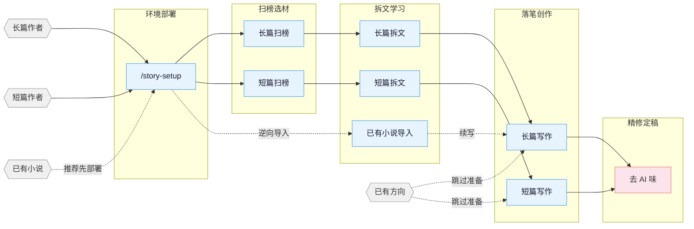

<p align="center">
  
</p>

<h1 align="center">Oh Story</h1>

<p align="center">
  <b>网文写作 skill 包：扫榜、拆文、写作、去AI味、封面图一套流程，装进你正在用的编程 Agent。</b>
</p>

<p align="center">
  <a href="https://zenstory.ai/zh/oh-story"><b>项目主页</b></a>
  &nbsp;·&nbsp;
  <a href="#安装"><b>安装</b></a>
  &nbsp;·&nbsp;
  <a href="#常见问题"><b>常见问题</b></a>
  &nbsp;·&nbsp;
  <a href="README_EN.md"><b>English</b></a>
</p>

<p align="center">
  <a href="https://github.com/zenstory-ai/oh-story-claudecode/stargazers"></a>
  <a href="https://github.com/zenstory-ai/oh-story-claudecode/releases/latest"></a>
  
  <a href="./LICENSE"></a>
</p>

<p align="center">
  <a href="https://t.me/ohstoryclaudecode"></a>
  <a href="https://github.com/zenstory-ai/oh-story-claudecode/discussions"></a>
</p>

<video src="https://github.com/user-attachments/assets/8f9cc11b-1fb8-4cc5-a084-e0deb05ec791" controls muted playsinline width="100%"></video>

## 这是什么

Oh Story 覆盖长篇与短篇网络小说的全流程：**扫榜选材 → 拆解爆款 → 搭大纲写正文 → 去AI味 → 生成封面图**。
它以 13 个 skill 的形式装进你已经在用的编程 Agent，写作用的模型就是该 Agent 的模型，不需要 GPU，也不需要另外配模型。

- **用文件系统当记忆** — 设定、大纲、正文、追踪各自独立维护。几百章的长篇不靠对话记忆硬撑，压缩上下文也不会丢伏笔。
- **确定性检查与门禁** — 写正文前没有细纲会被拦下；写完自动扫截断、工程词和字数欠账。7 个专业 Agent、8 个自动化 hook、100+ 份写作方法论按需加载。
- **装进 8 款编程 Agent** — Claude Code · Codex CLI · Google Antigravity · OpenCode · ZCode · OpenClaw · Reasonix，以及能读取项目文件的通用 Web AI / Agent 环境。
- **面向的平台** — 起点、番茄、晋江、七猫、知乎盐言等长短篇平台。

> **套路 = 确定性的情绪满足**

专业作者的方法论三步走：**扫榜**（洞察题材、人设、切入点）→ **拆文**（拆解节奏与剧情素材，建立个人模块库）→ **商业化写作**（运用钩子、爽感、期待感）。
围绕四条线展开：爆款逆向 · 剧情模块化重组 · 上下文状态分层管理 · 人机协同。

## 安装

```bash
npx skills add zenstory-ai/oh-story-claudecode -y -g
```

`-g` 全局安装，所有目录可用；去掉 `-g` 则只装到当前目录。**更新时重新执行同一条命令即可。**

也可以直接对 Agent 说一句话（支持导入 GitHub 仓库 / skill 的平台都适用）：

```
安装这个 skill https://github.com/zenstory-ai/oh-story-claudecode
```

装好后，在写作项目根运行 `/story-setup`（Codex 用 `$story-setup`）部署 hooks / agents / references，**然后新开会话**。升级后同样重跑一次 `/story-setup`。

> 各 Agent 的部署差异、已知限制与安装排查（Windows `ENOENT`、Antigravity `agy -p`、目录残留等）见 **[各编程 Agent 的部署与安装排查](docs/hosts.md)**。
> 最新版本 **v0.7.10**（2026-09-09）；变更见 [CHANGELOG.md](CHANGELOG.md) 与 [Releases](https://github.com/zenstory-ai/oh-story-claudecode/releases)。

## 看看它的输出

下面每一份都是 skill 跑出来的文件，完整样例在 **[demo/](demo/README.md)**。

### 续写状态卡：为什么几百章不会崩

下面这本是项目作者自己的长篇，用 `/story-import` 把已发布的前 20 章反向重建成可续写工程。
下面是**写第 21 章之前**的状态卡。`/story-long-write` 不靠对话记忆，它把连续性写进
`追踪/上下文.md`，下一章只读这一份——固定 7 栏、硬上限 12KB，不进正文 prompt：

```markdown
## 当前位置
- 当前章：第20章   卷：第一卷·军宣整顿   故事时间：《如愿》点击破亿后的第二天

## 长期约束
- 军宣爽点必须通过作品效果、传播数据和围观反应链兑现，不能只靠系统播报。
- 钟嘉嘉未公开的军方培养安排属于作者真相，正文揭示前不能当成读者已知。

## 活跃伏笔
- F016｜钟嘉嘉并非普通军报实习生，她的军方家庭背景仍未完全公开｜埋第7章｜回收章未定｜高
- F049｜吴伟收到寻衅滋事公诉通知，最终法律结果尚未落地｜埋第18章｜回收章未定｜高
- F054｜一位老兵邀请江晨上门听当年的故事，为后续创作提供入口｜埋第20章｜回收章未定｜高

## 下一章承诺
- 先补第21章细纲，再承接老兵邀请、新歌伴奏和钢琴能力。
```

**「作者真相」和「读者已知」是分开记的**——这是角色提前知道答案、伏笔写飞的主要来源。
完整文件：[`demo/长篇/.../追踪/上下文.md`](demo/长篇/让你管账号，你高燃混剪炸全网/追踪/上下文.md)

### 续写第 21 章：从门禁到回写，一条链走完

上面的视频录的就是这一段。`/story-long-write 写第21章` 在一次真实会话里的产出与每一道检查：

```text
细纲       细纲_第021章.md              追踪里写着「第21章尚无细纲」，skill 先补纲：单元 L1-03、目标情绪、本章标价、闭环状态、10 个情节点五列表格
章级检查   storyctl.py chapter check   字数 2068 / 目标 2300 · internal_pass
             ├ check-ai-patterns.js     0 命中
             ├ check-degeneration.js    0 命中
             └ normalize-punctuation    0 命中
追踪提交   storyctl.py chapter commit  tracking_committed=true · state_revision 0 → 1
派生视图   tracking_commit.py check    上下文.md / 伏笔.md / 角色状态/ / 时间线/ / 逐章记录/ 全部由 state 重生成，逐字一致
```

写正文前 `guard-outline-before-prose.sh` 会拦住缺细纲的章节；细纲过结构验收后，才由 `narrative-writer` 分两批写正文，
再由 `consistency-checker` 查事实与伏笔、去味审查改读感，最后跑确定性收尾脚本与 `chapter check`。

提交之后，追踪状态是工具从 `_tracking-state.json` 整份重新渲染的，**手改派生文件会被 `check` 拒绝**。
对照上面的状态卡，回写实际改了什么（节选，省略了同批滚动的近三章速记与角色状态）：

```diff
 ## 当前位置
-- 当前章：第20章   场景：火箭军文工团，钟嘉嘉送来老兵书法礼后
+- 当前章：第21章   场景：火箭军文工团办公室，江晨收到谭守义地址回信后
 ## 活跃伏笔
-- F054｜一位老兵邀请江晨上门听当年的故事，为后续创作提供入口｜埋第20章｜回收章未定｜高
+- F054｜谭守义已给邻市地址，江晨定次日上门听故事｜埋第20章｜第22章｜高
+- F057｜谭守义有个讲了五十年没人听全过的故事，内容未揭示｜埋第21章｜第22章｜高
+- F058｜任务三：离别主题作品、开放日当天热度1000万+、限时14天｜埋第21章｜第27章｜高
 ## 下一章承诺
-- 先补第21章细纲，再承接老兵邀请、新歌伴奏和钢琴能力。
+- 江晨向周薄森请假出营，赴邻市听谭守义讲完整故事并录音，揭示F057。
 ## 连贯性风险
-- 第21章尚无细纲，不能直接写正文。
+- 谭守义故事的作者真相为候选（E015），作者可在第22章细纲前改；揭示前不当读者已知。
```

新角色谭守义有了自己的设定卡和角色状态文件；他那个「讲了五十年没人听全过」的故事，真相候选（E015）记在
`时间线/作者真相.md` 并标为未揭示，`读者已知.md` 那一栏只有江晨看到的那句话。被退役的那条风险写进了
`逐章记录/第021章.md` 的「本章退役登记」——**状态不会静默消失**。

成品：[`正文/第021章_离别怎么会开花.md`](demo/长篇/让你管账号，你高燃混剪炸全网/正文/第021章_离别怎么会开花.md)
· [`大纲/细纲_第021章.md`](demo/长篇/让你管账号，你高燃混剪炸全网/大纲/细纲_第021章.md)
· [`设定/角色/谭守义.md`](demo/长篇/让你管账号，你高燃混剪炸全网/设定/角色/谭守义.md)
· [`追踪/逐章记录/第021章.md`](demo/长篇/让你管账号，你高燃混剪炸全网/追踪/逐章记录/第021章.md)


### 拆文报告：评分要给得出理由

`/story-long-analyze` 拆《盘龙》开篇 23 章（约 6.2 万字，起点经典，仅作拆解素材），按番茄男频升级流读者口味打分：

| 维度 | 评分 | 说明（节选） |
|------|------|------|
| 开篇钩子 | 2 | 前 500 字纯地理定位 + 晨练群像，无悬念 / 冲突 / 反差，靠「平民努力出头」慢渗。代入扎实但即时拉力弱。 |
| 主角塑造 | 4 | 延迟点名（第 60 段才点名）+ 他人惊叹引出，「衰败贵族 + 六岁神童」反差立人设。三章里最强项。 |
| 爽点设计 | 1 | 三章零传统爽点，爽感被刻意延迟到第 18 章金手指登场，赌代入复利。 |

> **综合**：三章是「立人设强、给爽点零」的极端结构。直接照搬会劝退番茄读者，
> 但拆出来的局部技法（导师代言设定、延迟点名、身体反应外化）高度可复用。

完整报告：[`demo/拆文库/盘龙/拆文报告.md`](demo/拆文库/盘龙/拆文报告.md)

### 短篇拆文：把自己的作品拆成可复用的模块

`/story-short-analyze` 拆《曾将爱意私藏》（作者自己的短篇，约 8,500 字，追妻火葬场 · 死遁），
产出 54 个情节节点、11 项写作手法。每个节点都锚定原文，并标注情绪类型与强度（−9~+9）：

| 原文 | 抽出的结构 |
|---|---|
| 「霍总还不打算让沈暮月母子进门吗？」<br>「没必要，私生子而已。」<br>我正准备推门而入，听到这话，手停在了半空。 | **N1 门口偷听到「私生子而已」**<br>类型{信息} · 情绪{震惊}{−7}<br>手法{开篇即冲突+信息差} |
| 霍庭煜对我没有爱。<br>我默然抽回了手。<br>该放弃自己的执念了。 | **N2 认清对方无爱，决意放弃执念**<br>类型{情绪} · 情绪{心酸}{−5} |

同一份产出里，`写作手法.md` 直接点出原作的代价：

> **POV 代价**：男主的转变缺乏过程展示，N47 的内心独白集中倒出「早就原谅、夜不能寐、深爱」，
> 略显直白说明（tell 多于 show）——这是第一人称追妻文的通病。

下游 `/story-short-write` 直接读这些手法写同题材新篇。
完整产出：[`demo/拆文库/曾将爱意私藏/`](demo/拆文库/曾将爱意私藏/)

### 去 AI 味：逐条匹配已知句式

`/story-deslop` 的本地检查是写作 lint：逐条匹配已知句式模板，
给出行号、命中片段和改写方向。拿一段人工构造的 AI 腔样例扫描，8 处命中（7 blocking）：

```text
改前.md:7:20     [blocking] em-dash             (么叫做命运的安排——不是巧合，而是一)
改前.md:7:22     [blocking] not-is-comparison   (不是巧合，而是一种冥冥之中的注定)
改前.md:11:1     [blocking] negation-parade     (没有犹豫，没有生涩，)
改前.md:19:3     [blocking] voice-contrast      (声音不大，却)
改前.md:21:2     [blocking] not-is-comparison   (不是一次简单的弹奏，而是一场蓄谋已久的惊艳亮相)
改前.md:3:1      [advisory] cliche-density-tic  (仿佛 一丝 深吸一口气 缓缓 微微)
```

同一场戏在第 21 章正文里的原样跑同一个扫描：**零命中，exit 0**。
两段字数几乎一样，差别在于改前用抽象判词替读者定性，改后把同一件事交给可见的动作和物件。

完整对照与全部 9 条命中：**[demo/去AI味对照/](demo/去AI味对照/README.md)**

### 本地写作工作台与封面

`/story dashboard` 在本机 `127.0.0.1` 打开写作工作台，浏览拆文库与项目文件树，小说内容不上传。

| 工作台 | `/story-cover` 生成的封面 |
|---|---|
|  |  |

## 安装后的第一条请求

复制、改一改就能用：按当前任务选一条，把〈占位内容〉换成自己的信息。

1. **开一本新书**
   > 我想开一部〈类型/题材〉新书。先从我提供的材料中分开已确定事实与待决问题；只规划一个有边界的开篇，交付核心冲突、视角/信息释放限制、前三章变化和待决项。不要自动写正文；题材取舍、角色动机和长期方向留给我确认。
2. **导入已有书稿**
   > 请把这份书稿整理成可续写项目。第 1–〈N〉章完整，〈文件名〉是第〈N+1〉章残稿；保留原文，不覆盖完整章节，不把残稿算作完整章，推断出的设定单列待确认。先交付识别范围、重建事实、冲突/歧义和待我确认的决定，供我审阅；暂不续写。
3. **修一段不满意的正文**
   > 这段读起来〈空泛/重复/过度解释〉。先指出具体读感问题，保留故事事实、角色已知和未揭示边界；只交付这一段的修订建议、前后对照与理由，不全书改写。哪些建议采用由我决定。

## 流程总览



## Skills

| Skill | 触发 | 说明 |
|:------|:-----|:-----|
| `story-setup` | `/story-setup` `$story-setup` `/准备写书` | 环境部署 · Claude/Antigravity/OpenCode/Codex/ZCode/OpenClaw/Reasonix + generic（已有配置安全合并） |
| `story` | `/story` `$story` `/story dashboard` | 工具箱路由 · 模糊意图分发 + 作者习惯管理 + 本地拆文/项目 Dashboard |
| `story-long-write` | `/story-long-write` `/写长篇` | 长篇写作 · 大纲搭建、人物设定、正文输出 |
| `story-long-analyze` | `/story-long-analyze` | 长篇拆文 · 黄金三章、爽点设计、节奏分析 |
| `story-long-scan` | `/story-long-scan` | 长篇扫榜 · 起点/番茄/晋江市场趋势 |
| `story-short-write` | `/story-short-write` | 短篇写作 · 情绪设计、反转构思、精修出稿 |
| `story-short-analyze` | `/story-short-analyze` | 短篇拆文 · 故事核、结构分析、情感线、反转设计、写作手法、共鸣分析 |
| `story-short-scan` | `/story-short-scan` | 短篇扫榜 · 知乎盐言/番茄短篇风口数据 |
| `story-deslop` | `/story-deslop` `/去AI味` | 去AI味 · 检测并清除 AI 写作痕迹 |
| `story-import` | `/story-import` `/导入小说` | 逆向导入 · 将已有小说反向解析为标准项目结构 |
| `story-review` | `/story-review` `/审查` | 多视角审查 · 4 Agent 多视角审稿 + 番茄/起点/知乎评分标准 |
| `story-cover` | `/story-cover` `/封面` | 封面生成 · 书名题材分析 + GPT-Image-2（Codex 内置用量 / API 回退） |
| `browser-cdp` | `/browser-cdp` | 浏览器操控 · CDP 协议复用登录态抓取数据 |

> `story-deslop` 的本地检查是写作 lint：blocking 只限确定性句式/标点问题，其他提示按读感判断；朱雀等外部检测只作自测参考，不替代人工读感。

自然语言同样触发：
- 「帮我开书」→ `story-long-write`
- 「这篇太 AI 了」→ `story-deslop`
- 「把我的书导进来」→ `story-import`
- 「打开工作台」→ `story dashboard`（本机浏览拆文库与写作项目，可轻量编辑）
- 「记住我的写作习惯」→ `story` 作者记忆（原话证据、待确认、冲突替代）
- 「沈栀现在什么状态」→ 自动 spawn `story-explorer` agent

### Story Dashboard

运行 `/story dashboard`（Codex 用 `$story dashboard`）打开本地写作工作台，浏览拆文库与
长/短篇项目文件树，并完成搜索、Markdown 预览、文本编辑、冲突保护保存和确认删除。
服务仅监听 `127.0.0.1`，小说内容不会上传。

## 工作原理

三层结构，细节见 **[工作原理：Agent、Hooks 与项目结构](docs/architecture.md)**。

**① 文件系统当记忆** — 一部长篇动辄几十万字。设定、大纲、正文、追踪拆成独立目录各自维护，
对话只负责创作，不负责记忆。`追踪/` 下的 `_tracking-state.json` 是唯一结构化权威，
派生出上下文卡、伏笔视图、角色状态和「作者真相 / 读者已知」双时间线。

**② 7 个专业 Agent 分工** — story-architect（Opus，架构）、narrative-writer（Sonnet，正文）、
consistency-checker（Haiku，一致性）、character-designer、story-researcher、story-explorer、chapter-extractor。
由 `/story-setup` 部署，**必须先部署再新开会话**才会生效。

**③ 8 个自动化 hook 守住质量** — 其中只有一个是阻断性的：
`guard-outline-before-prose.sh` 在缺对应细纲时**阻止首次创建正文**，强制先搭大纲。
其余（会话快照、缺口检测、压缩前后续接、提交校验、正文写入后扫描）都只提醒，不打断写作。

各 skill 的 `references/` 知识库按需加载、不占上下文，全部主题清单见 **[知识体系](docs/knowledge-base.md)**。

## 适用平台

**长篇** 起点中文网 · 番茄小说 · 晋江文学城 · 七猫小说 · 刺猬猫

**短篇** 知乎盐言故事 · 番茄短篇 · 七猫短篇

真实产出样例见 [demo/](demo/)：短篇拆文《曾将爱意私藏》· 长篇拆文《盘龙》· 长篇续写工程《让你管账号，你高燃混剪炸全网》· 封面《剑道独尊》示例图。

这套 skill 现在能让我度过找工作的过渡期 :joy:，希望也能帮到有需要的朋友。

## 常见问题

### 能在 Codex、Google Antigravity、OpenCode 里用吗，还是只支持 Claude Code？

oh-story-claudecode 内置适配 Claude Code、Google Antigravity、OpenCode、ZCode、OpenClaw、Codex CLI 和 Reasonix。Codex 会直接扫描仓库内 `.agents/skills` 发现 13 个 skill，用 `$story-setup` 调用；Antigravity 用 `/skills` 或自然语言运行 `story-setup` 并选择 `target_cli=antigravity`；OpenCode 需要 2.x，1.x 加载不了写正文守卫插件；能读取项目文件的 Web AI / Agent 环境也可以按通用 skills 路径使用。

### 需要 GPU 或自己部署模型吗？

不需要。oh-story-claudecode 是一组 skill，运行在你已经在用的编程 Agent 里，写作用的模型就是该 Agent 的模型；本地只跑确定性的检查脚本（Node / Python）。唯一的例外是 `story-cover` 封面生成，它调用 GPT-Image-2（Codex 内置用量或 API 回退）。

### 每章字数不统一、字数对不上怎么办？

从 v0.7.7 起，长篇正文只用一个机器统计的字数口径：每份细纲必须写明合法的「字数目标」，缺少时会停止而不是回退到 3000；欠字不会自动加戏，超字最多压缩一次。写入后 `check-prose-after-write.sh` 会提醒字数欠账。升级旧项目后重跑 `/story-setup` 并新开会话即可生效。

### 去AI味之后，朱雀等 AI 检测还是判定为 AI 怎么办？

`story-deslop`（`/去AI味`）是写作 lint：它确定性地检测并清除已知的 AI 句式、标点和退化痕迹，目标是读感，不是绕过检测器。朱雀等外部检测只作自测参考，不替代人工读感。
可按[这份具体改稿指南](https://zenstory.ai/zh/oh-story/revise-ai-prose)把空泛情绪、重复句式、拔高议论和过度解释分别处理，同时保留场景任务与作者设定；本仓库的实现细节见[去AI味的具体做法](docs/how-to-remove-ai-flavor-from-web-fiction.md)。

### 已经写了一部分的小说，能导入后继续写吗？

可以。先在写作项目根运行 `/story-setup`，新开或刷新会话后运行 `/story-import`（`/导入小说`）把已有小说反向解析成标准项目结构，审阅反推结果，再用 `/story-long-write 日更` 或 `/story-long-write 写第N章` 续写。[导入与续写指南](https://zenstory.ai/zh/oh-story/import-and-continue)说明了为什么书稿证据应优先于模型猜测。

### 长篇续写怎样减少忘伏笔或角色提前知道答案？

续写前分开故事客观事实、角色已知和读者已见，只带上本章相关的当前状态与未完承诺。[长篇连续性指南](https://zenstory.ai/zh/oh-story/long-novel-continuity)给出三章示例，[AI 写长篇小说怎么不崩人设：Oh Story 的做法](docs/ai-long-novel-character-consistency.md)说明本仓库的连续性机制。

### 章纲齐全，为什么写出来还是在复述设定？

把章纲当作“本章必须发生什么变化”的规格，再把目标、阻碍、证据、选择和代价转成视角人物可感知的行动与结果。[章纲到章节指南](https://zenstory.ai/zh/oh-story/outline-to-chapter)给出编辑示例。

### 怎样保留我的文风，又不把另一本书的情节带进来？

把你自己写的或获准使用的短样本拆成表达维度，与当前书的事实分开讨论；样本推断不自动成为长期偏好。[作者文风指南](https://zenstory.ai/zh/oh-story/preserve-author-voice)说明如何裁决当前要求、本书文风与作者偏好；样本只作表达参考，不复制原句。

### Windows 上安装报 `ENOENT ... mkdir`，但末尾显示 Done，正常吗？

这是有技能没装全。无论有没有报错，重跑同一条安装命令即可修复；如果参考资料目录缺了一块，`/story-setup` 会提示参考资料包不完整。Codex 用户在 Windows 上还需要为 git 打开 `core.symlinks`。

### 升级到新版本后要做什么？

重跑 `/story-setup` 并新开会话。7 个专业 agent（story-architect、narrative-writer、consistency-checker 等）由 `/story-setup` 写入项目目录，必须先部署再新开会话，多 agent 协作才会生效。

### 短篇和长篇的入口有什么区别？

长篇：`/story-long-scan`（扫榜）→ `/story-long-analyze`（拆文）→ `/story-long-write`（写作，含大纲、卷纲、细纲、正文）。短篇：`/story-short-scan` → `/story-short-analyze` → `/story-short-write`。两条线共用 `/story-setup`、`/story-deslop`、`/story-review` 和 `/story-cover`。

## 延伸阅读

- [提示词、技能包、插件与 MCP 怎么分](https://zenstory.ai/zh/oh-story/agent-skills-for-writers) — 先选写作任务，再选 Agent 与流程
- [导入 10–20 章后接着写](https://zenstory.ai/zh/oh-story/import-and-continue) — 审阅反推结果，以书稿证据为准
- [分开角色已知、承诺与线索](https://zenstory.ai/zh/oh-story/long-novel-continuity) — 别把未来计划当成已发生事实
- [把剧情规格写成可见变化](https://zenstory.ai/zh/oh-story/outline-to-chapter) — 用行动、选择、代价和结果推进
- [用具体改稿减少“AI 味”](https://zenstory.ai/zh/oh-story/revise-ai-prose) — 改读感，不追求鉴定分数
- [分开文风选择与本书事实](https://zenstory.ai/zh/oh-story/preserve-author-voice) — 用自有或获准样本，不复制原句
- [AI 写长篇小说怎么不崩人设：Oh Story 的做法](docs/ai-long-novel-character-consistency.md) — 仓库内文档
- [去AI味的具体做法](docs/how-to-remove-ai-flavor-from-web-fiction.md) — 仓库内文档
- [扫榜和拆文的自动化做法](docs/scan-charts-and-deconstruct-bestsellers.md) — 仓库内文档
- [Claude Code skills for writers](docs/claude-code-skills-for-writers.md) — 仓库内文档（英文）

## 贡献

欢迎贡献新 skill、补充知识库、更新市场数据。详见 [CONTRIBUTING.md](CONTRIBUTING.md)。

## 交流

- **Telegram 群**：<https://t.me/ohstoryclaudecode> —— 日常交流、踩坑、新功能讨论。
- **GitHub Discussions**：[提问 / 求助 / 分享用法](https://github.com/zenstory-ai/oh-story-claudecode/discussions)，方便检索。
- **GitHub Issues**：[Bug、输出质量 Case、功能请求](https://github.com/zenstory-ai/oh-story-claudecode/issues/new/choose)，请按结构化表单提供复现材料或具体输出证据。

## 贡献者

<a href="https://github.com/zenstory-ai/oh-story-claudecode/graphs/contributors"></a>

## 致谢

- [LINUX DO - The New Ideal Community](https://linux.do) — 社区支持
- [FanqieRankTracker](https://github.com/wen1701/FanqieRankTracker) — 番茄小说字体反爬解码方案参考
- [Zhuque AIGC Detector CLI](https://github.com/Sophomoresty/zhuque) — 去 AI 味实验中的外部复测工具参考

## ZenStory AI 项目

Oh Story 是 [ZenStory AI](https://zenstory.ai/zh) 的一部分——一组开源、面向 agent 的故事创作、改编与生产工具（GitHub 组织：[zenstory-ai](https://github.com/zenstory-ai)）。同组织项目：

| 项目 | 用途 |
| --- | --- |
| [oh-story-claudecode](https://github.com/zenstory-ai/oh-story-claudecode) | 网文写作 skill 包（本仓库） |
| [drama-skills](https://github.com/zenstory-ai/drama-skills) | AI 短剧 / 漫剧创作 skill 合集：剧本、资产、分镜、图片/视频提示词、独立审查 |
| [novel-to-game](https://github.com/zenstory-ai/novel-to-game) | 面向原著改编、指定运行环境构建与运行证据 QA 的 agent skills |
| [video-recap-skills](https://github.com/zenstory-ai/video-recap-skills) | 将支持的视频文件制作成中文解说，可选导出可编辑的剪映/CapCut 草稿 |
| [oh-story-dsh](https://github.com/zenstory-ai/oh-story-dsh) | DeepSeek Harness 社区插件，提供小说、短剧、游戏和视频解说工作台 |
| [zenstory](https://github.com/zenstory-ai/zenstory) | 对话即创作的 AI 小说写作工作台（[app.zenstory.ai](https://app.zenstory.ai)） |
