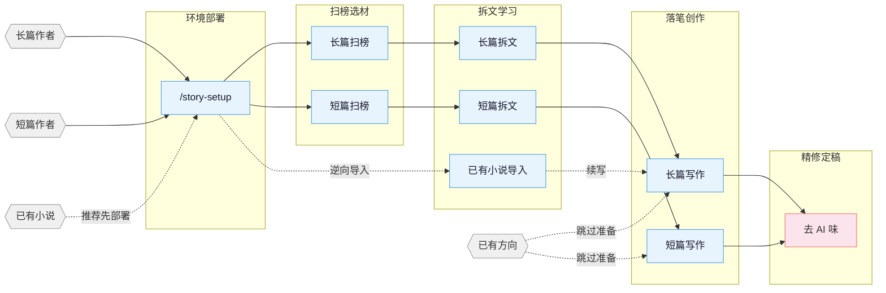

[English](README_EN.md) | **中文**

# oh-story-claudecode

网文写作 skill 包，覆盖长篇与短篇网络小说的扫榜、拆文、写作、去AI味、封面图全流程。内置适配 Claude Code、Google Antigravity、OpenCode、ZCode、OpenClaw、Codex CLI、Reasonix；能读取项目文件的 Web AI / Agent 环境也可按通用 skills 路径使用。

## 核心思路

> **套路 = 确定性的情绪满足**

专业作者的方法论三步走：

1. **扫榜**：分析热门榜单，洞察题材、人设、切入点。
2. **拆文**：拆解大纲节奏与剧情素材，建立个人模块库。
3. **商业化写作**：学习并运用钩子、爽感、期待感等核心技巧。

围绕四条线展开：爆款逆向 · 剧情模块化重组 · 上下文状态分层管理 · 人机协同。

> **Antigravity 支持预览**：`story-setup` 可把 13 个 Skills、7 个 custom agents、Always-On Rule 和 workspace Hooks 完整部署到项目 `.agents/`。部署器不修改 `~/.gemini/`，不依赖全局目录或 symlink；`.agents/hooks.json` 只替换顶层 `oh-story` 管理组并保留用户组。本契约沿用 `agents_version: 29`，部署后需新开 Antigravity conversation；IDE 与交互式 `agy` 建议分别试用。

> **v0.7.9 — 短篇按场景功能校准**：短篇移除逐节最低字数、每节 3-5 个子事件、对白占比和固定钩子节距等机械配额，改按「本场是否改变风险、信息、关系、资源、决定、行动或读者理解」判断；导语作为正文第一场，第 1 章从其后果或新行动继续。新增细纲结构验收，细纲的目标情绪与主角关键选择不再接受占位符。升级后需重跑 `/story-setup`、新开会话；本版 `agents_version` 为 29。[完整变更](CHANGELOG.md#079---2026-08-30)
>
> **v0.7.8 — 参考拆分与门禁**：长短篇参考资料按消费者拆开改名，写正文与短篇构思前新增会阻断的 Reference Gate，短篇 Phase 2 与交付各加一个确定性 verifier；短篇总字数以用户给的范围为准。升级后需重跑 `/story-setup`、新开会话；本版 `agents_version` 为 28。[完整变更](CHANGELOG.md#078---2026-08-28)
>
> **v0.7.7 — 记忆与收口**：长篇正文改用唯一机器字数口径，欠字不自动加戏，超字最多压缩一次；新增跨会话作者记忆、Codex 内置 ImageGen，并修复 story-setup 递归复制。缺少合法「字数目标」现在会停止，不再回退到 3000。升级后需重跑 `/story-setup`、新开会话；本版 `agents_version` 为 26。[完整变更](CHANGELOG.md#077---2026-08-26)
>
> 更早版本变更见 [CHANGELOG.md](CHANGELOG.md)。

## 流程总览



## 安装

**方式一** 直接告诉 Claude Code / Antigravity / OpenCode / ZCode / OpenClaw / Codex / Reasonix，或其他支持导入 GitHub 仓库/skill 的 Web AI / Agent 平台：

```
安装这个 skill https://github.com/zenstory-ai/oh-story-claudecode
```

升级时再说一次同一句话即可。

**方式二** 命令行：

```bash
npx skills add zenstory-ai/oh-story-claudecode -y -g
```

`-g` 全局安装，所有目录可用；去掉 `-g` 则只装到当前目录。更新时重新执行同一条命令即可。

Windows 上偶尔会看到 `ENOENT ... mkdir` 报错但末尾仍显示 `Done!`，这是有技能没装全。story-setup 的参考资料目录整个缺了一块时，跑 `/story-setup` 会提示参考资料包不完整；其它形式的残缺不一定有提示。无论有没有报错，重跑同一条安装命令即可修复。

<details>
<summary>Antigravity / Codex / ZCode / OpenCode / OpenClaw / Reasonix / Web AI 使用说明</summary>

**Antigravity 用户：** 先用 `/skills` 或自然语言运行 `story-setup`，选择 `target_cli=antigravity`。它只在当前写作项目创建/更新 13 个 `.agents/skills/` 已知目录、7 个 `.agents/agents/agent-name/agent.md` 已知定义（`agent-name` 替换为实际名称）、`.agents/rules/oh-story.md`、两个 `.agents/hooks/` runtime 文件与 `.agents/hooks.json` 的 `oh-story` 管理组；其他用户 Skills、Agents、Rules、Hooks 和 hook groups 都保留，部署器本身不会写 `~/.gemini/`。项目内 Skills 使用真实目录；若 `.agents/skills` 已是 symlink，会先解释 git diff 并征求明确迁移同意，未同意绝不沿链接写入。Hook 依赖 PATH 中的 `node`；部署后新开 conversation，再分别在 IDE 与交互式 `agy` 中 smoke test。**`agy 1.1.22 -p` 暂不在支持面内**：每次 headless 进程都可能在静默鉴权完成前扫描 workspace，鉴权后又不重载 custom agents/hooks，导致 skill 回退、`subagent not found`，甚至把普通模型输出写到 `~/.gemini/antigravity-cli/scratch/`。命令行写作请从项目目录启动交互式 `agy`，确认 `/skills`、`/agents`、`/hooks` 已发现 oh-story 后再发任务；测试后检查 scratch 没有意外小说产物。

**Codex 用户：** repo 内直接使用：Codex 会扫描 `$REPO_ROOT/.agents/skills`（指向 `skills/` 的 symlink）发现 13 个 skill；用 `$story`、`$story-setup` 或 `/skills` 调用。Windows 上 git 需开 `core.symlinks=true`，否则 symlink 失效，改走下方 `$story-setup` 部署。

跑 `$story-setup` 部署到写作项目后，会写入 `.codex/agents/*.toml`、`.codex/hooks.json`、`.codex/hooks/{story_codex_hook.py,run-story-hook.sh,run-story-hook.cmd}` 和 `.codex/skills/story-setup/references/agent-references/`；请信任项目 `.codex/` 配置层并在 `/hooks` review/trust hooks、新开 Codex 会话，让 custom agents 生效。

**ZCode 用户：** 在 Plugin Management 中把本仓库加入 marketplace，安装 `oh-story` 后可用 `$story`、`$story-setup` 或 `/` 面板调用 13 个 Skills/Commands。`$story-setup` 选择 `target_cli=zcode` 会部署 `.zcode/skills/`、`.zcode/commands/`、`.zcode/hooks/story_zcode_hook.js`，安全合并 `.zcode/config.json` 与根 `AGENTS.md`；Hook 依赖 PATH 中的 `node`。ZCode 3.3.4 不执行项目/plugin custom agents，也没有 `PreCompact` / `SessionEnd`，相关流程会明确降级 solo/direct，compact 后由 `SessionStart` 恢复上下文。

**OpenCode 用户：** 全局安装后 opencode 自动从 `~/.claude/skills/` 发现 skills；首次用自然语言触发 story-setup（如「用 story-setup 部署网文写作环境」），**部署后退出重进 `opencode -c`** 才能用 slash command。部分 hook 行为与 Claude Code 有差异（session-start / session-end / compact 等），详见 [CONTRIBUTING.md](CONTRIBUTING.md) 的 OpenCode 章节。

**OpenClaw 用户：** 当前支持 skills-only：OpenClaw 可从 workspace `skills/`、`.agents/skills`、`~/.agents/skills`、`~/.openclaw/skills` 等 skill root 发现本项目 13 个 skill；`SKILL.md` 已按 OpenClaw 要求使用单行 `name` / `description` 与单行 JSON `metadata.openclaw`。`story-setup` 选择 `target_cli=openclaw` 时会把 skills 复制到项目 `skills/` 并写入 OpenClaw 版 `AGENTS.md`；agents/hooks 暂不部署，写正文前大纲守卫在 OpenClaw 下是 skill 内软约束。部署后如未显示新 skills，请新开 OpenClaw session 或等待 watcher 刷新。

**Reasonix 用户：** 当前支持 skills + 原生 plugin manifest：Reasonix 原生扫描项目 skill root（`.agents/skills` 等，指向 `skills/` 的 symlink）发现 13 个 skill，用 `reasonix doctor capabilities` 校验；也可用根 `reasonix-plugin.json` 走 `reasonix plugin install`。`story-setup` 选择 `target_cli=reasonix` 时会把 skills 复制到项目 `skills/` 并写入 Reasonix 版 `AGENTS.md`；hooks/custom agents 暂不部署，涉及专业 Agent 的 skill 走 solo/direct fallback。Windows 未启用 symlink 时改走原生 plugin。

**Web AI / 通用 Agent 用户：** 平台能读取 GitHub 仓库或项目文件时，可让 Agent 读取 `skills/*/SKILL.md` 与对应 `references/`；需要本地副本时，`story-setup` 可选 `target_cli=generic`，只写通用 `AGENTS.md` 和 `skills/`。无本项目 hooks/custom agents 的环境按 skill 内软约束或 solo/direct fallback 执行。

**OpenClaw / Reasonix / 通用路径的目录残留要手动清：** 这三条路径的 skill 副本在项目 `skills/` 里，重跑 `/story-setup` 执行的就是项目里那份，自动清理到不了。项目里若出现 `skills/story-setup/references/agent-references/agent-references/`（可能嵌了多层）或 `skills/story-setup/skills/`，手动删掉。要让项目里的 skill 文本本身更新，还需要重新安装本项目后，用新包覆盖项目 `skills/` 下这 13 个目录。

</details>

升级后如果项目里已经跑过 `/story-setup`，建议在项目根重跑一次 `/story-setup`，同步 hooks / agents / references。每版变更见 [CHANGELOG.md](CHANGELOG.md) 与 [Releases](https://github.com/zenstory-ai/oh-story-claudecode/releases)。

**多 agent 协作要先部署再新开会话：** 7 个专业 agent（story-architect、narrative-writer、consistency-checker 等）由 `/story-setup` 写入项目 `.claude/agents/`，由 `$story-setup` 写入 `.codex/agents/*.toml`，或由 Antigravity `story-setup` 生成 `.agents/agents/agent-name/agent.md`（`agent-name` 替换为实际名称）。Antigravity 使用 `invoke_subagent` + 同名 `TypeName`；运行时未暴露 custom subagent 时按 skill 明确降级 solo/direct。判断是否生效：新会话里跑 `/story-review`，报告头是 `Effective Mode: full/lean` 即注册成功，是 `Fallback: ... -> solo` 说明当前运行时未暴露该 agent。

**导入续写顺序：** 推荐先在写作项目根运行 `/story-setup`（部署 hooks/agents/AGENTS），新开/刷新会话后运行 `/story-import` 导入已有小说，再用 `/story-long-write 日更` 或 `/story-long-write 写第N章` 续写。也可以直接运行 `/story-import`；它会先检测是否已 setup，未部署时让你选择先去 setup 或继续串行导入。

**作者习惯会跨会话延续：** 对 `/story` 说“记住我的写作习惯”，稳定偏好会进入工作区 `.story/作者记忆/`；看到 `Author Memory Receipt` 才算写入成功。普通写作只查询本次相关的已确认条目，输出硬上限 2KB，不把完整画像、候选和历史塞进正文 prompt。它与每本书的剧情追踪分开，当前要求、本书设定和硬性门禁始终优先。

## Skills

| Skill | 触发 | 说明 |
|:------|:-----|:-----|
| `story-setup` | `/story-setup` `$story-setup` `/准备写书` | 环境部署 · Claude/Antigravity/OpenCode/Codex/ZCode/OpenClaw/Reasonix + generic（已有配置安全合并） |
| `story` | `/story` `$story` `/story dashboard` | 工具箱路由 · 模糊意图分发 + 作者习惯管理 + 本地拆文/项目 Dashboard |
| `story-long-write` | `/story-long-write` `/写长篇` | 长篇写作 · 大纲搭建、人物设定、正文输出 |
| `story-long-analyze` | `/story-long-analyze` | 长篇拆文 · 黄金三章、爽点设计、节奏分析 |
| `story-long-scan` | `/story-long-scan` | 长篇扫榜 · 起点/番茄/晋江市场趋势 |
| `story-short-write` | `/story-short-write` | 短篇写作 · 情绪设计、反转构思、精修出稿 |
| `story-short-analyze` | `/story-short-analyze` | 短篇拆文 · 故事核、结构分析、情感线、反转设计、写作手法、共鸣分析 |
| `story-short-scan` | `/story-short-scan` | 短篇扫榜 · 知乎盐言/番茄短篇风口数据 |
| `story-deslop` | `/story-deslop` `/去AI味` | 去AI味 · 检测并清除 AI 写作痕迹 |
| `story-import` | `/story-import` `/导入小说` | 逆向导入 · 将已有小说反向解析为标准项目结构 |
| `story-review` | `/story-review` `/审查` | 多视角审查 · 4 Agent 多视角审稿 + 番茄/起点/知乎评分标准 |
| `story-cover` | `/story-cover` `/封面` | 封面生成 · 书名题材分析 + GPT-Image-2（Codex 内置用量 / API 回退） |
| `browser-cdp` | `/browser-cdp` | 浏览器操控 · CDP 协议复用登录态抓取数据 |

> `story-deslop` 的本地检查是写作 lint：blocking 只限确定性句式/标点问题，其他提示按读感判断；朱雀等外部检测只作自测参考，不替代人工读感。

自然语言同样触发：
- 「帮我开书」→ `story-long-write`
- 「这篇太 AI 了」→ `story-deslop`
- 「把我的书导进来」→ `story-import`
- 「打开工作台」→ `story dashboard`（本机浏览拆文库与写作项目，可轻量编辑）
- 「记住我的写作习惯」→ `story` 作者记忆（原话证据、待确认、冲突替代）
- 「沈栀现在什么状态」→ 自动 spawn `story-explorer` agent

### Story Dashboard

运行 `/story dashboard`（Codex 用 `$story dashboard`）打开本地写作工作台，浏览拆文库与
长/短篇项目文件树，并完成搜索、Markdown 预览、文本编辑、冲突保护保存和确认删除。
服务仅监听 `127.0.0.1`，小说内容不会上传。


<details>
<summary>封面生成示例</summary>


</details>

<details>
<summary>拆文 demo — 盘龙</summary>

使用 `/story-long-analyze` 深度模式分析《盘龙》前23章的完整输出：

```
demo/拆文库/盘龙/
├── 概要.md              # 全书概要 + 章节索引
├── 拆文报告.md           # 五维评分 + 爽点密度 + 可借鉴套路
├── 文风.md              # 句长/标点/对话潜台词/情绪节奏 + 原文锚点
├── 章节/
│   ├── 第1章_深度拆解.md … 第3章_深度拆解.md  # 黄金三章逐章深度分析
│   └── 第1章_摘要.md … 第23章_摘要.md          # 每章一个摘要文件
├── 角色/
│   ├── 林雷.md           # 主角完整档案
│   ├── 霍格.md           # 核心配角
│   ├── 希尔曼.md         # 核心配角
│   ├── 希里.md           # 功能角色
│   ├── 德林柯沃特.md      # 核心配角
│   ├── 沃顿.md           # 功能角色
│   └── 角色关系.md        # 关系网络
├── 剧情/
│   ├── 故事线.md          # 框架识别 + 4剧情 + 2故事线
│   ├── 强者过境与魔法启蒙.md 等  # 五个分场景剧情单元
│   ├── 节奏.md            # 节奏/关键信息递进/情绪触发爆发节律
│   └── 情绪模块.md        # 读者需求/情绪引擎/可复用写作模块
└── 设定/
    ├── 世界观/
    │   ├── 背景设定.md    # 核心规则 + 特殊设定
    │   ├── 力量体系.md    # 战气 + 魔法 + 等级
    │   ├── 地理.md        # 安达卢西亚 + 玉兰大陆
    │   └── 金手指.md      # 盘龙戒指 + 德林柯沃特
    └── 势力/
        └── 巴鲁克家族.md  # 龙血血脉家族档案
```

长篇拆文会额外生成 `文风.md`，并在 `剧情/` 下产出 `节奏.md`（节奏/关键信息递进/情绪触发爆发节律）和 `情绪模块.md`（读者需求/情绪引擎/可复用写作模块）；日更写作会通过 `对标/{书名}/剧情/` 读取这些素材，避免文风、节奏和情绪模块偏离对标书。

</details>

<details>
<summary>拆文 demo — 曾将爱意私藏（短篇）</summary>

使用 `/story-short-analyze` 拆解短篇《曾将爱意私藏》（约 8500 字，追妻火葬场 · 死遁）的完整输出：

```
demo/拆文库/曾将爱意私藏/
├── 原文/原文.txt        # 原文备份
├── 拆文报告.md          # 故事核 + 五维评分 + 爆点6维 + 认知反转 + 共鸣9层
├── 情节节点.md          # 54 个情节节点（原文引用 + 情绪标记 −9~+9）
├── 写作手法.md          # POV / 对话 / 信息差 / 物件钩子 等 11 项
└── _meta.json           # 结构计数 structure_counts（Phase 7 门控依据）
```

短篇拆文产出 `拆文报告 / 情节节点 / 写作手法`，下游 `/story-short-write` 据此写同题材新短篇。

</details>

<details>
<summary>导入 demo — 让你管账号，你高燃混剪炸全网（长篇续写工程）</summary>

推荐先 `/story-setup` 部署写作项目，再使用 `/story-import` 把作者已发布的前 20 章（约 3.7 万字）逆向重建为可续写的写作工程，最后接 `/story-long-write 日更` 或 `/story-long-write 写第21章` 续写：

```
demo/长篇/让你管账号，你高燃混剪炸全网/
├── 正文/        第001–020章（已发布原文）
├── 大纲/        大纲.md · 卷纲_第1卷.md · 细纲_第001–020章.md（1 章 1 文件）
├── 设定/        角色/{江晨·钟嘉嘉·周薄森·张耀祖·吴伟·李林}
│                世界观/{背景设定·金手指} · 关系.md · 题材定位.md · 文风.md
└── 追踪/        _tracking-state.json · 上下文.md · 伏笔.md · 逐章记录/
                 角色状态/{角色名}.md · 时间线/{作者真相.md·读者已知.md}
```

逐章提取（事件 / 角色 / 设定 / 伏笔 / 时间线）反推为续写 bible，作者从第 21 章无缝接着写。

</details>

## Agent 体系

写作 skill 内部通过 7 个专业 Agent 协作，各司其职：

| Agent | 模型 | 职责 |
|:------|:-----|:-----|
| **story-architect** | Opus | 故事架构 · 题材定位、大纲结构、钩子/反转设计、情绪弧线 |
| **character-designer** | Sonnet | 角色设计 · 角色档案、语言风格、动机链、对话创作 |
| **narrative-writer** | Sonnet | 叙事写手 · 正文写作、去AI味、格式合规 |
| **consistency-checker** | Haiku | 一致性检查 · 事实冲突扫描、伏笔追踪、S1-S4 分级报告 |
| **story-researcher** | Sonnet | 资料研究 · CDP 搜索+正文提取、多源交叉验证、结构化参考文件输出 |
| **story-explorer** | Haiku | 故事查询 · 角色/伏笔/设定/进度只读查询，日更上下文快速加载 |
| **chapter-extractor** | Haiku | 章节提取 · 摘要+情节点+角色提及，并行拆文核心单元 |

Agent 按需加载 `references/` 中的写作理论（角色设计、对话技法、反转工具箱等 100+ 份方法论文件），不预占上下文。

## 自动化 Hooks

`/story-setup` 为 Claude Code 部署 8 个自动化 hook：

| Hook | 触发时机 | 功能 |
|:-----|:---------|:-----|
| session-start.sh | 会话开始 | 显示分支、进度快照、拆文状态 |
| session-end.sh | 会话结束 | 记录会话日志到 `追踪/session-log.txt` |
| detect-story-gaps.sh | 会话开始 | 检测设定缺口、大纲缺失、伏笔断线 |
| pre-compact.sh | 上下文压缩前 | 保存进度快照路径和行数摘要 |
| post-compact.sh | 上下文压缩后 | 提示读取进度快照恢复上下文 |
| validate-story-commit.sh | git commit 时 | 检查硬编码属性、设定必填字段（仅警告，不阻断） |
| guard-outline-before-prose.sh | 写正文前（Write/Edit） | 缺对应细纲/小节大纲时阻止首次创建正文（阻断），强制先搭大纲 |
| check-prose-after-write.sh | 正文写入后（Write/Edit） | 轻量扫描截断、工程词、毒句式和字数欠账（提醒，不阻断） |

## 项目文件结构

一部长篇动辄几十万字、几百章。设定冲突、伏笔断线、时间线对不上——写到最后全靠记忆硬撑，迟早翻车。

用文件系统把设定、大纲、正文、追踪拆开，每个维度独立维护。对话只负责创作，不负责记忆。

工作区级作者记忆独立于单本小说：

```text
.story/作者记忆/
├── _author-memory-state.json  # 唯一结构化权威
├── 作者画像.md               # 已确认、可用于创作的偏好
├── 待确认.md                 # 推断、重复修正和冲突候选
└── 变更记录.md               # 可审计的替代与撤回历史
```

**长篇：**

```
{书名}/
├── 设定/
│   ├── 世界观/          # 背景、力量体系等，按主题拆文件
│   ├── 角色/            # 每个人物一个文件（江晨.md、钟嘉嘉.md）
│   ├── 势力/            # 每个势力/组织一个文件（火箭军文工团.md）
│   ├── 关系.md          # 角色关系映射
│   └── 题材定位.md      # 题材核心梗+对标分析
├── 大纲/
│   ├── 大纲.md          # 全书卷级结构
│   ├── 卷纲_第一卷.md   # 每卷一个：爽点节奏+情绪弧线+人物弧线+伏笔+反转
│   ├── 细纲_第001章.md  # 每章一个：内容概括+多线情节+人物关系/出场顺序+钩子
│   └── ...
├── 正文/
│   ├── 第001章_章名.md
│   └── ...
├── 对标/                # 对标参考（结构化子目录从拆文库同步）
│   └── {对标书名}/
│       ├── 原文/            # 对标书原文章节
│       ├── 角色/            # 结构化角色卡（从 analyze 输出同步）
│       ├── 剧情/            # 结构化剧情线/节奏/情绪模块（从 analyze 输出同步）
│       ├── 设定/            # 结构化设定（从 analyze 输出同步）
│       ├── 文风.md          # 日更前读取，用来贴近对标书文风
│       └── 拆文报告.md      # analyze skill 输出的拆文报告
├── 追踪/                # 文件优先的连续性状态
│   ├── _tracking-state.json # 唯一结构化权威状态（不进正文 prompt）
│   ├── 上下文.md        # 派生续写状态卡（固定 7 栏，≤12KB）
│   ├── 逐章记录/        # 每章未来相关连续性记录/修订覆盖层（≤3072 bytes）
│   ├── 角色状态/        # 派生核心角色快照（江晨.md、钟嘉嘉.md）
│   ├── 伏笔.md          # 派生伏笔当前视图
│   └── 时间线/          # 派生作者真相.md + 读者已知.md
├── 参考资料/            # story-researcher 输出的研究资料
│   └── {topic}.md       # 按研究主题拆分
```

**短篇：**

```
短篇/{标题}/
├── 正文.md              # 完成稿
├── 小节大纲.md          # 8 节结构 + 情绪曲线
└── 拆文库/              # 如有参考小说（analyze 输出）
    └── {书名}/
        ├── 拆文报告.md
        ├── 情节节点.md
        └── 写作手法.md
```

**拆文库：** 拆文 skill 默认输出到项目根目录 `拆文库/{书名}/`，产出结构化目录（角色/剧情/设定/章节），其中长篇剧情目录包含 `节奏.md` 和 `情绪模块.md`，是 analyze 的源数据（source of truth）。写作 skill 通过 `对标/{书名}/剧情/` 等子目录消费这些资产（项目级引用视图），或自动回退读取 `拆文库/`。

**`.active-book`：** 项目根目录的文本文件，内容是当前活跃书目的**相对路径**（如 `长篇/我的小说`），hook 和写作 skill 据此定位当前项目。

## 知识体系

各 skill 自带 `references/` 知识库，按需加载，不占上下文。

<details>
<summary>展开各 skill 知识库主题清单</summary>

| 主题 | 内容 | 所在 skill |
|:-----|:-----|:-----------|
| 大纲排布 | 五步大纲法 · 故事结构分级 · 节点设计法 · 升级感设计 | long-write |
| 开头设计 | 开篇模式 · 前 500 字设计 · 黄金三章开头策略 | long-write / short-write |
| 人物设计 | 角色设定 · 人物提取 · 关系映射 · 动机链 · 群像 | long-write / short-write / short-analyze |
| 钩子技法 | 章尾钩子 13 式 · 章首钩子 7 式 · 段落级钩子 · 悬念编排 | long-write / short-write / short-analyze |
| 情绪设计 | 6 种弧形模板 · 期待感管理 · 题材赛道策略 | long-write / short-write |
| 题材框架 | 长篇八节点 · 短篇压缩三幕 · 8 大题材开头模板 | long-write / short-write / short-analyze |
| 对话技法 | 节奏 · 潜台词 · 信息控制 · 对话模式数据库 | long-write / short-write |
| 反转工具箱 | 类型 · 时机 · 误导底层路径 | long-write / short-write |
| 风格模块 | 对话 · 打斗 · 智斗 · 镜头式写作 · 装逼打脸 · 白描 | long-write |
| 高级技法 | 小纲四步法 · 高潮逆推 · 双线结构 · AB 交织法 | long-write |
| 去AI味 | 预防 · 三遍去AI法 · 改写范例库 · 禁用词表 | deslop / long-write / short-write |
| 质量检查 | 通用 · 长篇专项 · 短篇专项 · 毒点排查 | long-write / short-write / short-analyze |
| 写作公式 | 21 大题材写作公式 · 三翻四震 · 感情线四阶段 | short-write / short-analyze |
| 女频写作 | 女读者偏好 · 情感描写 · 感情线模式 · 对标拆书 | short-write |
| 拆文方法 | 黄金三章 · 情绪曲线 · 结构拆解 · 知乎风格分析 | long-analyze / short-analyze |
| 短篇方法论 | 故事核 · 情节节点 · 爆点分析 · 写作手法 · 节奏分析 · 共鸣分析 · 人物分类 · 平台适配 | short-analyze |
| 拆文实例 | 完整案例拆解 · 模板化输出 | short-analyze |
| 读者画像 | 9 维画像 · 目标读者分析 | long-scan |
| 市场数据 | 题材趋势 · 平台特性 · 采集格式 · 投稿指南 | long-scan / short-scan |
| 封面风格 | 10 大题材视觉风格 · 色彩构图 · 提示词模板 | story-cover |
| 多视角审稿 | 多视角审稿 · 评分标准 · 毒点排查 | story-review |

</details>

## 适用平台

**长篇** 起点中文网 · 番茄小说 · 晋江文学城 · 七猫小说 · 刺猬猫

**短篇** 知乎盐言故事 · 番茄短篇 · 七猫短篇

真实产出样例见 [demo/](demo/)：短篇拆文《曾将爱意私藏》· 长篇拆文《盘龙》· 长篇续写工程《让你管账号，你高燃混剪炸全网》· 封面《剑道独尊》示例图。

这套 skill 现在能让我度过找工作的过渡期 :joy:，希望也能帮到有需要的朋友。

## 贡献

欢迎贡献新 skill、补充知识库、更新市场数据。详见 [CONTRIBUTING.md](CONTRIBUTING.md)。

## 交流

- **Telegram 群**：<https://t.me/ohstoryclaudecode> —— 日常交流、踩坑、新功能讨论。
- **GitHub Discussions**：[提问 / 求助 / 分享用法](https://github.com/zenstory-ai/oh-story-claudecode/discussions)，方便检索。
- **GitHub Issues**：[Bug、输出质量 Case、功能请求](https://github.com/zenstory-ai/oh-story-claudecode/issues/new/choose)，请按结构化表单提供复现材料或具体输出证据。

## 致谢

- [LINUX DO - The New Ideal Community](https://linux.do) — 社区支持
- [FanqieRankTracker](https://github.com/wen1701/FanqieRankTracker) — 番茄小说字体反爬解码方案参考
- [Zhuque AIGC Detector CLI](https://github.com/Sophomoresty/zhuque) — 去 AI 味实验中的外部复测工具参考
