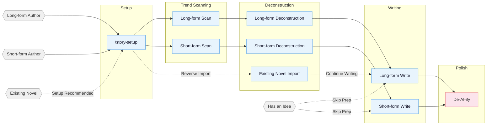

<!-- Last synced with README.md: 2026-09-16 -->


<p align="center">
  
</p>

<h1 align="center">Oh Story</h1>

<p align="center">
  <b>A skill pack for writing Chinese web fiction: chart scanning, deconstruction, drafting, de-AI-ify and cover art, running inside the coding agent you already use.</b>
</p>

<p align="center">
  <a href="https://zenstory.ai/oh-story"><b>Project page</b></a>
  &nbsp;·&nbsp;
  <a href="#installation"><b>Install</b></a>
  &nbsp;·&nbsp;
  <a href="#faq"><b>FAQ</b></a>
  &nbsp;·&nbsp;
  <a href="README.md"><b>中文</b></a>
</p>

<p align="center">
  <a href="https://github.com/zenstory-ai/oh-story-claudecode/stargazers"></a>
  <a href="https://github.com/zenstory-ai/oh-story-claudecode/releases/latest"></a>
  
  <a href="./LICENSE"></a>
</p>

<p align="center">
  <a href="https://t.me/ohstoryclaudecode"></a>
  <a href="https://github.com/zenstory-ai/oh-story-claudecode/discussions"></a>
</p>

<video src="https://github.com/user-attachments/assets/8f9cc11b-1fb8-4cc5-a084-e0deb05ec791" controls muted playsinline width="100%"></video>

## What it is

Oh Story covers the whole web-fiction pipeline, long-form and short: **chart scanning → deconstructing bestsellers → outline and prose → de-AI editing → cover art**.
It installs as 13 skills into the coding agent you already use; the writing model is that agent's model. No GPU, no separate model setup.

- **The file system is the memory** — settings, outlines, prose and continuity tracking are maintained as separate files. A several-hundred-chapter novel does not lean on conversation memory, and context compaction does not lose your foreshadowing.
- **Deterministic checks and gates** — writing prose without a chapter blueprint is blocked; after each write, truncation, engineering vocabulary and word-count debt are scanned automatically. 7 specialist agents, 8 hooks and 100+ methodology files load on demand.
- **Runs in 8 coding agents** — Claude Code · Codex CLI · Google Antigravity · OpenCode · ZCode · OpenClaw · Reasonix, plus generic Web AI / agent environments that can read project files.
- **Target platforms** — Qidian, Fanqie, Jinjiang, Qimao, Zhihu Yanyan and other long/short-form Chinese platforms.

> **Trope = a reliable delivery of emotion.**

The professional author's method in three steps: **scan** the charts (genre, cast, angle) → **deconstruct** a bestseller (pacing and plot material, built into your own module library) → **write commercially** (hooks, payoff, anticipation).
Four throughlines: reverse-engineering hits · modular plot recombination · layered context and state · human-agent collaboration.

## Installation

```bash
npx skills add zenstory-ai/oh-story-claudecode -y -g
```

`-g` installs globally for every directory; drop it to install into the current directory only. **To update, run the same command again.**

You can also just tell your agent (any platform that can import a GitHub repo or skill):

```
Install this skill https://github.com/zenstory-ai/oh-story-claudecode
```

Then run `/story-setup` from your writing-project root (`$story-setup` in Codex) to deploy hooks / agents / references, **and start a fresh session**. Re-run `/story-setup` after every upgrade.

> Per-host deployment differences, known limits and install troubleshooting (Windows `ENOENT`, Antigravity `agy -p`, leftover directories) are in **[Host deployment and install troubleshooting](docs/hosts_EN.md)**.
> Latest release **v0.7.10** (2026-09-09); see [CHANGELOG.md](CHANGELOG.md) and [Releases](https://github.com/zenstory-ai/oh-story-claudecode/releases).

## See what it produces

Every file below was written by the skills; full samples in **[demo/](demo/README_EN.md)**.

### The continuity card: why several hundred chapters hold together

The novel below is the project author's own; `/story-import` rebuilt the 20 published chapters
into a continuable project. This is the continuity card **as it stood before chapter 21 was written**.
`/story-long-write` does not rely on conversation memory: continuity lives in `追踪/上下文.md`, and the
next chapter reads only that file — 7 fixed sections, a hard 12 KB cap, never in the prose prompt:

```markdown
## Current position
- Chapter 20 · Volume 1 · Story time: the day after "如愿" passed 100M views

## Standing constraints
- Propaganda payoffs must land through the work's real effect, reach data and bystander reaction —
  never through a system announcement alone.
- Zhong Jiajia's undisclosed military background is author-truth; it cannot be treated as
  reader-known until the prose reveals it.

## Live foreshadowing
- F016｜Zhong Jiajia is not an ordinary intern reporter｜planted ch.7｜payoff TBD｜high
- F049｜Wu Wei has received a criminal summons; the legal outcome has not landed｜planted ch.18｜high
- F054｜A veteran invited Jiang Chen to hear his story — an entry point for later work｜planted ch.20｜high

## Promises for the next chapter
- Write the ch.21 blueprint first, then pick up the veteran's invitation, the new backing track
  and the piano skill.
```

**Author-truth and reader-known are tracked separately** — conflating them is the main reason
characters "already know" things and foreshadowing goes stale.
Full file: [`demo/长篇/.../追踪/上下文.md`](demo/长篇/让你管账号，你高燃混剪炸全网/追踪/上下文.md)

### Continuing into chapter 21: gate to write-back, end to end

The video above is this exact session. What `/story-long-write 写第21章` produced, and every check on the way:

```text
Blueprint       细纲_第021章.md              tracking said "no blueprint for ch.21", so the skill wrote one first: unit L1-03, target emotion, stakes, loop state, a 10-row five-column plot table
Chapter check   storyctl.py chapter check   2068 chars / target 2300 · internal_pass
                  ├ check-ai-patterns.js     0 hits
                  ├ check-degeneration.js    0 hits
                  └ normalize-punctuation    0 hits
Tracking commit storyctl.py chapter commit  tracking_committed=true · state_revision 0 → 1
Derived views   tracking_commit.py check    上下文.md / 伏笔.md / 角色状态/ / 时间线/ / 逐章记录/ all re-rendered from state, byte-identical
```

Before any prose, `guard-outline-before-prose.sh` blocks a chapter with no blueprint; once the blueprint passes
structural checks, `narrative-writer` drafts the prose in two batches, `consistency-checker` audits facts and
foreshadowing, a de-AI review edits for readability, and the deterministic closing scripts plus `chapter check` run last.

After the commit, tracking state is re-rendered in full from `_tracking-state.json`; **hand-editing a derived view is
rejected by `check`**. Against the card above, this is what the write-back changed (excerpt; the rolling recent-chapter
digest and character snapshots are omitted):

```diff
 ## Current position
-- Chapter 20 · Scene: the propaganda troupe, after Zhong Jiajia delivers the veterans' calligraphy
+- Chapter 21 · Scene: the troupe office, after Jiang Chen receives Tan Shouyi's address
 ## Live foreshadowing
-- F054｜A veteran invited Jiang Chen to hear his story｜planted ch.20｜payoff TBD｜high
+- F054｜Tan Shouyi has sent his address; Jiang Chen will visit tomorrow｜planted ch.20｜payoff ch.22｜high
+- F057｜Tan Shouyi has a story "fifty years long that no one has heard to the end"; contents unrevealed｜planted ch.21｜payoff ch.22｜high
+- F058｜Task three: a "farewell" piece, 10M+ heat on open day, 14-day limit｜planted ch.21｜payoff ch.27｜high
 ## Promises for the next chapter
-- Write the ch.21 blueprint first, then pick up the veteran's invitation, the backing track and the piano skill.
+- Jiang Chen asks for leave, travels to the neighbouring city to hear Tan Shouyi's full story and records it; F057 revealed.
 ## Continuity risks
-- Chapter 21 has no blueprint yet; prose cannot be written directly.
+- The truth behind Tan Shouyi's story is a candidate (E015); the author may change it before the ch.22 blueprint; not reader-known until revealed.
```

The new character Tan Shouyi gets his own setting card and character-state file; the candidate truth behind his story
(E015) sits in `时间线/作者真相.md` marked unrevealed, while `读者已知.md` holds only the one line Jiang Chen has read.
The retired risk line was written into `逐章记录/第021章.md` under "本章退役登记" — **state never vanishes silently**.

Output: [`正文/第021章_离别怎么会开花.md`](demo/长篇/让你管账号，你高燃混剪炸全网/正文/第021章_离别怎么会开花.md)
· [`大纲/细纲_第021章.md`](demo/长篇/让你管账号，你高燃混剪炸全网/大纲/细纲_第021章.md)
· [`设定/角色/谭守义.md`](demo/长篇/让你管账号，你高燃混剪炸全网/设定/角色/谭守义.md)
· [`追踪/逐章记录/第021章.md`](demo/长篇/让你管账号，你高燃混剪炸全网/追踪/逐章记录/第021章.md)


### A deconstruction report: scores that come with reasons

`/story-long-analyze` on the first 23 chapters of *Coiling Dragon* (~62k characters, a Qidian classic
used purely as analysis input), scored against
the taste of a Fanqie male-oriented progression-fantasy reader:

| Dimension | Score | Note (excerpt) |
|------|------|------|
| Opening hook | 2 | The first 500 characters are pure geography plus a morning-drill ensemble — no suspense, conflict or contrast. Immersion is solid, immediate pull is weak. |
| Protagonist | 4 | Named late (paragraph 60), introduced through others' astonishment; "declining noble house + six-year-old prodigy" sets the contrast. The strongest of the three chapters. |
| Payoff design | 1 | Zero conventional payoffs across three chapters; gratification is deliberately delayed to the chapter-18 cheat item, betting on compounding immersion. |

> **Overall**: an extreme structure — strong on character, zero on payoff. Copying this opening
> would lose Fanqie readers, but the local techniques it yields (exposition through a mentor,
> delayed naming, externalising resolve through the body) are highly reusable.

Full report: [`demo/拆文库/盘龙/拆文报告.md`](demo/拆文库/盘龙/拆文报告.md)

### Short-form deconstruction: turning your own story into reusable modules

`/story-short-analyze` on *曾将爱意私藏* — the project author's own short story (~8,500 characters,
"chasing wife" / faked-death genre) — yields 54 plot nodes and 11 technique notes. Every node is
anchored to the source text and tagged with emotion type and intensity (−9 to +9):

| Source text | Extracted structure |
|---|---|
| 「霍总还不打算让沈暮月母子进门吗？」<br>「没必要，私生子而已。」<br>我正准备推门而入，听到这话，手停在了半空。 | **N1 Overhears "just a bastard child" at the door**<br>type{information} · emotion{shock}{−7}<br>technique{open on conflict + information gap} |
| 霍庭煜对我没有爱。<br>我默然抽回了手。<br>该放弃自己的执念了。 | **N2 Accepts he does not love her; resolves to let go**<br>type{emotion} · emotion{bitterness}{−5} |

In the same output, `写作手法.md` names what the original costs:

> **POV cost**: the male lead's turn is never dramatised; the interior monologue at N47 dumps
> "long forgiven, sleepless, deeply in love" all at once — telling rather than showing, the standard
> weakness of first-person stories in this genre.

`/story-short-write` then reads these technique notes to draft a new story in the same genre.
Full output: [`demo/拆文库/曾将爱意私藏/`](demo/拆文库/曾将爱意私藏/)

### De-AI editing: rule-by-rule matching

The local check in `/story-deslop` is a writing lint. It matches known sentence templates and returns the line, the span and a rewrite
direction. Scanning a hand-constructed AI-flavored sample returns 8 findings (7 blocking):

```text
改前.md:7:20     [blocking] em-dash             (么叫做命运的安排——不是巧合，而是一)
改前.md:7:22     [blocking] not-is-comparison   (不是巧合，而是一种冥冥之中的注定)
改前.md:11:1     [blocking] negation-parade     (没有犹豫，没有生涩，)
改前.md:19:3     [blocking] voice-contrast      (声音不大，却)
改前.md:21:2     [blocking] not-is-comparison   (不是一次简单的弹奏，而是一场蓄谋已久的惊艳亮相)
改前.md:3:1      [advisory] cliche-density-tic  (仿佛 一丝 深吸一口气 缓缓 微微)
```

The same scene as it stands in chapter 21 scans **zero findings, exit 0**.
Both passages are nearly the same length; the difference is that the first tells the reader what to
feel, and the second hands the same beat to visible action and objects.

Full comparison and all 8 findings: **[demo/去AI味对照/](demo/去AI味对照/README_EN.md)**

### Local workbench and covers

`/story dashboard` opens a local workbench on `127.0.0.1` to browse deconstruction libraries and
project trees. Story content is never uploaded.

| Workbench | Cover from `/story-cover` |
|---|---|
|  |  |

## Your First Request

Copy one, tweak it and send it: pick the brief that fits your task and replace the 〈placeholders〉.

1. **Start a new book**
   > I want to start a new 〈genre/premise〉 book. First separate fixed facts in my material from decisions that remain open. Plan only a bounded opening and deliver the central conflict, viewpoint/information-release limits, changes across the first three chapters and open decisions. Do not draft prose automatically; leave genre tradeoffs, character motives and the long-term direction for me to confirm.
2. **Import an existing manuscript**
   > Organize this manuscript as a continuable project. Chapters 1–〈N〉 are complete; 〈filename〉 is a partial chapter 〈N+1〉. Preserve the source prose, do not overwrite complete chapters, and do not count the fragment as a complete chapter, and separate inferred settings for confirmation. First deliver the detected range, reconstructed facts, conflicts/ambiguities and decisions requiring my confirmation for review; do not continue the story yet.
3. **Fix an unsatisfactory passage**
   > This passage reads as 〈vague/repetitive/over-explained〉. First name the specific reading problem while preserving story facts, character knowledge and unrevealed information. Deliver only a proposed revision of this passage, a before/after comparison and reasons—not a book-wide rewrite. I will decide which suggestions to accept.

## Pipeline Overview



## Skills

| Skill | Trigger | Description |
|:------|:--------|:------------|
| `story-setup` | `/story-setup` / `$story-setup` | Environment setup — Claude/Antigravity/OpenCode/Codex/ZCode/OpenClaw/Reasonix plus generic (safe merge) |
| `story` | `/story` / `$story` / `/story dashboard` | Toolbox router, author-preference management, and local deconstruction/project dashboard |
| `story-long-write` | `/story-long-write` | Long-form writing — outline building, character design, prose output |
| `story-long-analyze` | `/story-long-analyze` | Long-form deconstruction — Golden First 3 Chapters, payoff design, pacing analysis |
| `story-long-scan` | `/story-long-scan` | Long-form trend scan — Qidian/Fanqie/Jinjiang market trends |
| `story-short-write` | `/story-short-write` | Short-form writing — emotion design, twist crafting, polish & delivery |
| `story-short-analyze` | `/story-short-analyze` | Short-form deconstruction — story core, structure, emotional arc, reversal design, writing techniques, resonance analysis |
| `story-short-scan` | `/story-short-scan` | Short-form trend scan — Zhihu Yanyan/Fanqie short-form trending data |
| `story-deslop` | `/story-deslop` | De-AI-ify — detect and remove AI writing traces |
| `story-import` | `/story-import` | Reverse import — parse existing novels into standard project structure |
| `story-review` | `/story-review` | Multi-perspective review — 4-agent adversarial review + Fanqie/Qidian/Zhihu scoring rubrics |
| `story-cover` | `/story-cover` | Cover generation — title/genre analysis + GPT-Image-2 via Codex included usage or API fallback |
| `browser-cdp` | `/browser-cdp` | Browser control — CDP protocol for scraping with reusable login sessions |

> `story-deslop` uses local prose linting: blocking applies only to deterministic style/punctuation issues, while other findings require read-through judgment; external detectors such as Zhuque are self-check references, not replacements for human review.

Natural language also triggers: `帮我开书` ("help me start writing") → `story-long-write`, `这篇太AI了` ("this is too AI-ish") → `story-deslop`, `把我的书导进来` ("import my book") → `story-import`, `打开工作台` ("open the dashboard") → `story dashboard`, `记住我的写作习惯` ("remember my writing habits") → `story` author memory, `沈栀现在什么状态` ("what's Shen Zhi's current status") → `story-explorer`.

### Story Dashboard

Run `/story dashboard` (`$story dashboard` in Codex) to open the local writing desk. Browse
deconstruction libraries and long/short project trees, then search, preview Markdown, edit text,
save with conflict protection, or confirm a file deletion. It listens only on `127.0.0.1` and never
uploads story content.

## How it works

Three layers. Full detail in **[How it works: agents, hooks and project structure](docs/architecture_EN.md)**.

**1. The file system is the memory** — a long novel runs to hundreds of thousands of characters.
Settings, outlines, prose and tracking live in separate directories, each maintained independently;
the conversation writes, it does not remember. `追踪/_tracking-state.json` is the single structured
authority, deriving the context card, foreshadowing view, character states and the
author-truth / reader-known dual timeline.

**2. Seven specialist agents** — story-architect (Opus, structure), narrative-writer (Sonnet, prose),
consistency-checker (Haiku, continuity), plus character-designer, story-researcher, story-explorer
and chapter-extractor. Deployed by `/story-setup`; **deploy first, then start a fresh session**.

**3. Eight hooks hold quality** — only one of them blocks:
`guard-outline-before-prose.sh` prevents first creation of prose when the matching chapter blueprint
is missing, forcing the outline to come first. The rest (session snapshots, gap detection, pre/post
compaction handoff, commit validation, post-write scanning) only warn, and never interrupt writing.

Each skill's `references/` knowledge base loads on demand without consuming context; the full topic
list is in **[Knowledge base](docs/knowledge-base_EN.md)**.

## Supported Platforms

**Long-form** Qidian (起点中文网) · Fanqie Novels (番茄小说) · Jinjiang (晋江文学城) · Qimao (七猫小说) · Ciweimao (刺猬猫)

**Short-form** Zhihu Yanyan (知乎盐言故事) · Fanqie Short-form (番茄短篇) · Qimao Short-form (七猫短篇)

Real output samples are in [demo/](demo/): short-form deconstruction 《曾将爱意私藏》 · long-form deconstruction 《盘龙》 · long-form continuation project 《让你管账号，你高燃混剪炸全网》 · cover sample 《剑道独尊》.

I built this skill pack to help me through a job-hunting transition :joy:, and I hope it can help others too.

## FAQ

### Does it work in Codex, Google Antigravity or OpenCode, or only in Claude Code?

oh-story-claudecode ships adapters for Claude Code, Google Antigravity, OpenCode, ZCode, OpenClaw, Codex CLI and Reasonix. Codex discovers the 13 skills by scanning `.agents/skills` in the repo and invokes them with `$story-setup`; in Antigravity run `story-setup` via `/skills` or natural language and choose `target_cli=antigravity`. OpenCode needs 2.x, since 1.x cannot load the prose-guard plugin. Any Web AI or agent environment that can read project files can use the generic skills path.

### Do I need a GPU or to host a model?

No. oh-story-claudecode is a set of skills that runs inside the coding agent you already use, so the writing model is that agent's model; only deterministic check scripts (Node / Python) run locally. The one exception is `story-cover`, which calls GPT-Image-2 (Codex built-in quota or an API fallback).

### Chapter lengths are inconsistent or the word count is off. What do I do?

Since v0.7.7 long-form prose uses a single machine-counted length metric: every chapter blueprint must state a valid word target, and a missing target stops the run instead of falling back to 3,000; under-length chapters are not padded with new plot, and over-length chapters get at most one compression pass. `check-prose-after-write.sh` flags length debt after each write. Rerun `/story-setup` and start a new session after upgrading an older project.

### After de-AI editing, detectors such as Zhuque still flag the text as AI. Why?

`story-deslop` (`/去AI味`) is a writing lint: it deterministically detects and removes known AI sentence patterns, punctuation habits and degeneration artifacts. Its target is how the prose reads, not evading detectors. External detectors are a self-check reference only.
[This concrete revision guide](https://zenstory.ai/oh-story/revise-ai-prose) separates vague emotion, repeated syntax, unearned commentary and over-explaining while preserving the scene's job and the author's facts; this repository's own mechanism is described in [去AI味的具体做法](docs/how-to-remove-ai-flavor-from-web-fiction.md) (Chinese).

### I already have part of a novel written. Can I import it and continue?

Yes. Run `/story-setup` in the project root, start or refresh a session, run `/story-import` to reverse-parse the existing novel into the standard project layout, review its inferences, then continue with `/story-long-write 日更` or `/story-long-write 写第N章`. The [import-and-continue guide](https://zenstory.ai/oh-story/import-and-continue) explains why manuscript evidence should take priority over model guesses.

### How do I reduce forgotten clues or characters knowing answers too early in a long continuation?

Before continuing, separate objective story facts, character knowledge and what readers have seen; carry only the relevant current state and unfinished commitments into the chapter. The [long-novel continuity guide](https://zenstory.ai/oh-story/long-novel-continuity) gives a three-chapter example; [Keep an AI-written novel consistent over 100+ chapters](docs/keep-ai-novel-consistent-over-100-chapters.md) describes how this repository tracks continuity.

### My chapter outline is complete. Why does the prose still summarize the setup?

Treat the outline as a specification for what must change, then turn its goal, obstacle, evidence, choice and cost into actions and results the viewpoint character can perceive. The [outline-to-chapter guide](https://zenstory.ai/oh-story/outline-to-chapter) walks through an editorial example.

### How do I keep my voice without carrying plot facts over from another book?

Describe the dimensions of a short sample you wrote or may use, separately from the current book's facts; sample inference does not automatically establish an enduring preference. The [author-voice guide](https://zenstory.ai/oh-story/preserve-author-voice) explains how to resolve the current request, book style and author preferences; use samples as a reference for expression and never copy sentences.

### On Windows the install prints `ENOENT ... mkdir` but ends with Done. Is that normal?

It means some skills were not fully installed. Rerun the same install command, with or without the error, and it repairs itself; if a reference-material directory is missing, `/story-setup` reports the reference pack as incomplete. Codex users on Windows also need `core.symlinks` enabled in git.

### What do I do after upgrading?

Rerun `/story-setup` and start a new session. The seven agents (story-architect, narrative-writer, consistency-checker and others) are written into the project by `/story-setup`; multi-agent collaboration only takes effect after deploying and opening a fresh session.

### What is the difference between the short-form and long-form entry points?

Long-form: `/story-long-scan` (chart scanning) → `/story-long-analyze` (deconstruction) → `/story-long-write` (outline, volume outline, chapter blueprints, prose). Short-form: `/story-short-scan` → `/story-short-analyze` → `/story-short-write`. Both share `/story-setup`, `/story-deslop`, `/story-review` and `/story-cover`.

## Further reading

- [Prompts, skill packs, plugins and MCP](https://zenstory.ai/oh-story/agent-skills-for-writers) — choose the writing job before the host and workflow
- [Import 10–20 chapters and continue](https://zenstory.ai/oh-story/import-and-continue) — review inferred structure; treat the manuscript as evidence
- [Separate character knowledge, promises and clues](https://zenstory.ai/oh-story/long-novel-continuity) — do not turn future plans into past events
- [Write plot specifications as visible change](https://zenstory.ai/oh-story/outline-to-chapter) — advance through action, choice, cost and result
- [Reduce "AI-sounding" prose with concrete edits](https://zenstory.ai/oh-story/revise-ai-prose) — improve the reading experience, not a detector score
- [Separate voice choices from book facts](https://zenstory.ai/oh-story/preserve-author-voice) — use authorized samples without copying phrases
- [Keep an AI-written novel consistent over 100+ chapters](docs/keep-ai-novel-consistent-over-100-chapters.md) — in-repo doc
- [Claude Code skills that are not for coding: a fiction-writing pack as the worked example](docs/claude-code-skills-for-writers.md) — in-repo doc
- [去AI味的具体做法](docs/how-to-remove-ai-flavor-from-web-fiction.md) — in-repo doc (Chinese)
- [扫榜和拆文的自动化做法](docs/scan-charts-and-deconstruct-bestsellers.md) — in-repo doc (Chinese)

## Contributing

Contributions are welcome — new skills, knowledge base additions, market data updates. See [CONTRIBUTING.md](CONTRIBUTING.md) (Chinese only).

## Community

- **Telegram**: <https://t.me/ohstoryclaudecode> — chat, troubleshooting, and feature discussion.
- **GitHub Discussions**: [ask questions, get help, share workflows](https://github.com/zenstory-ai/oh-story-claudecode/discussions).
- **GitHub Issues**: [bugs, output-quality cases, and feature requests](https://github.com/zenstory-ai/oh-story-claudecode/issues/new/choose). Use the structured forms and include reproducible evidence or a concrete output sample.

## Contributors

<a href="https://github.com/zenstory-ai/oh-story-claudecode/graphs/contributors"></a>

## Acknowledgments

- [LINUX DO - The New Ideal Community](https://linux.do) — Community support
- [FanqieRankTracker](https://github.com/wen1701/FanqieRankTracker) — Fanqie Novels font obfuscation decoding reference
- [Zhuque AIGC Detector CLI](https://github.com/Sophomoresty/zhuque) — External retest reference used during anti-AI-writing experiments

## Part of ZenStory AI

Oh Story is part of [ZenStory AI](https://zenstory.ai) — open-source, agent-native tools for creating, adapting and producing stories (GitHub org: [zenstory-ai](https://github.com/zenstory-ai)). Sibling projects:

| Project | What it does |
| --- | --- |
| [oh-story-claudecode](https://github.com/zenstory-ai/oh-story-claudecode) | Web-fiction writing skill pack (this repo) |
| [drama-skills](https://github.com/zenstory-ai/drama-skills) | AI short-drama / motion-comic suite: scripts, assets, storyboards, image & video prompts, independent review |
| [novel-to-game](https://github.com/zenstory-ai/novel-to-game) | Agent skills for source-grounded novel adaptation, target-runtime builds, and evidence-based QA |
| [video-recap-skills](https://github.com/zenstory-ai/video-recap-skills) | Create Chinese-narration recaps from supported video files, with optional editable JianYing/CapCut draft export |
| [oh-story-dsh](https://github.com/zenstory-ai/oh-story-dsh) | Community DeepSeek Harness plugin with novel, short-drama, game and video-recap workbenches |
| [zenstory](https://github.com/zenstory-ai/zenstory) | Chat-to-create AI novel-writing workbench ([app.zenstory.ai](https://app.zenstory.ai)) |
