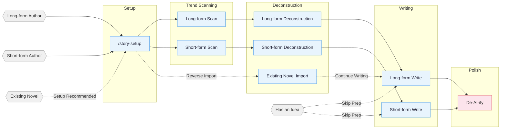

<!-- Last synced with README.md: 2026-08-30 -->

**English** | [中文](README.md)

# oh-story-claudecode

A web novel writing skill pack with built-in adapters for Claude Code, Google Antigravity, OpenCode, ZCode, OpenClaw, Codex CLI, and Reasonix. Web AI / agent environments that can read project files can use the generic skills path. Covers the full pipeline for long-form and short-form Chinese web novels: trend scanning, deconstruction, writing, AI tone removal, and cover generation.

## Core Approach

> **Tropes = deterministic emotional payoff**

Professional authors follow a three-step method:

1. **Scan** — analyze trending charts, identify genres, characters, and entry points.
2. **Deconstruct** — break down pacing and plot materials, build a personal module library.
3. **Commercialize** — learn and apply hooks, payoff density, expectation management.

Built around four pillars: reverse-engineering hits · plot modularization · layered state management · human-AI collaboration.

> **Antigravity support preview:** `story-setup` can deploy all 13 Skills, 7 custom agents, an Always-On Rule, and workspace Hooks into the project's `.agents/` tree. The deployer does not modify `~/.gemini/`, depend on global directories, or require symlink discovery. In `.agents/hooks.json`, it replaces only the top-level `oh-story` group and preserves user groups. This contract keeps `agents_version: 29`; open a fresh Antigravity conversation after deployment and smoke-test the IDE and interactive `agy` separately.

> **v0.7.9 — 短篇按场景功能校准**: short-form drops per-section word floors, the 3-5 sub-event rule, dialogue ratios, and fixed hook intervals in favour of a single readable test — does this scene change risk, information, relationships, resources, a decision, an action, or the reader's understanding? The teaser is now the first scene of the prose, and chapter 1 continues from its consequences rather than replaying it. Adds a structural verifier for chapter outlines; the outline's target-emotion and protagonist-choice fields no longer accept placeholders. Rerun `/story-setup` and start a new session; `agents_version` is 29. [Full changes](CHANGELOG.md#079---2026-08-30)
>
> **v0.7.8 — 参考拆分与门禁**: long-form and short-form references are split per consumer and renamed; a blocking Reference Gate now runs before prose writing and short-story design, and Phase 2 plus final delivery each gain a deterministic verifier. Short-story length now follows the range the user gave. Rerun `/story-setup` and start a new session; `agents_version` is 28. [Full changes](CHANGELOG.md#078---2026-08-28)
>
> **v0.7.7 — 记忆与收口**: long-form prose now uses one machine-enforced length metric; under-length chapters are not padded with new plot, and over-length chapters get at most one compression pass. This release also adds cross-session author memory and Codex built-in ImageGen, and fixes recursive story-setup copies. **The patch number does not convey this tightening**: a missing or invalid word target now stops instead of falling back to 3,000. Update the pack, rerun `/story-setup`, and start a new session; `agents_version` is 26. [Full changes](CHANGELOG.md#077---2026-08-26)
>
> For earlier versions, see [CHANGELOG.md](CHANGELOG.md).

## Pipeline Overview



## Installation

**Option 1** Tell Claude Code / Antigravity / OpenCode / ZCode / OpenClaw / Codex / Reasonix, or another Web AI / agent platform that can import a GitHub repo or skill:

```
Install this skill https://github.com/zenstory-ai/oh-story-claudecode
```

To upgrade, repeat the same instruction.

**Option 2** Command line:

```bash
npx skills add zenstory-ai/oh-story-claudecode -y -g
```

`-g` installs globally (available in every directory); drop `-g` to install only into the current directory. Re-run the same command to update.

On Windows you may occasionally see an `ENOENT ... mkdir` error while the run still ends with `Done!`. That means a skill was only partially installed. If a whole subdirectory of story-setup's reference bundle is missing, `/story-setup` reports an incomplete reference bundle; other forms of partial install may go unreported. Either way, re-run the same install command to fix it.

<details>
<summary>Antigravity / Codex / ZCode / OpenCode / OpenClaw / Reasonix / Web AI usage notes</summary>

**Antigravity users:** Run `story-setup` from `/skills` or by natural language and select `target_cli=antigravity`. Inside the current writing project it updates only 13 known `.agents/skills/` directories, 7 known `.agents/agents/agent-name/agent.md` definitions (`agent-name` stands for the actual name), `.agents/rules/oh-story.md`, two `.agents/hooks/` runtime files, and the managed `oh-story` group in `.agents/hooks.json`. Other user Skills, Agents, Rules, Hooks, and hook groups are preserved; the deployer itself never writes `~/.gemini/`. Skills are real project-local directories. If `.agents/skills` is already a symlink, setup explains the git-diff impact and requires explicit migration approval; without approval it never writes through the link. Hooks require `node` on PATH. Open a fresh conversation after deployment, then smoke-test both the IDE and interactive `agy`. **`agy 1.1.22 -p` is currently outside the supported surface:** each headless process may scan the workspace before silent authentication finishes, then fail to reload custom agents and hooks. The result can be a skill fallback, `subagent not found`, or ordinary model output under `~/.gemini/antigravity-cli/scratch/`. For CLI writing, start interactive `agy` from the project and confirm `/skills`, `/agents`, and `/hooks` have discovered oh-story before sending the task; check the scratch directory for accidental story output after testing.

**Codex users:** Use it in-place: Codex scans `$REPO_ROOT/.agents/skills` (a symlink to `skills/`) and discovers all 13 skills; invoke via `$story`, `$story-setup`, or `/skills`. On Windows, enable git `core.symlinks=true` or the symlink breaks — then use the `$story-setup` deployment below.

After `$story-setup` deploys into a writing project, it creates `.codex/agents/*.toml`, `.codex/hooks.json`, `.codex/hooks/{story_codex_hook.py,run-story-hook.sh,run-story-hook.cmd}`, and `.codex/skills/story-setup/references/agent-references/`. Trust the project `.codex/` layer, review/trust hooks in `/hooks`, and open a fresh Codex session so custom agents load.

**ZCode users:** Add this repository as a marketplace in Plugin Management and install `oh-story`; then invoke the 13 Skills/Commands through `$story`, `$story-setup`, or the `/` panel. With `target_cli=zcode`, `$story-setup` deploys `.zcode/skills/`, `.zcode/commands/`, and `.zcode/hooks/story_zcode_hook.js`, then safely merges `.zcode/config.json` and the root `AGENTS.md`. Hooks require `node` on PATH. ZCode 3.3.4 does not execute project/plugin custom agents and has no `PreCompact` or `SessionEnd`; affected workflows report a solo/direct fallback, while `SessionStart` restores context after compaction.

**OpenCode users:** After global install, opencode auto-discovers skills from `~/.claude/skills/`; trigger story-setup with natural language on first use (e.g., "use story-setup to deploy the web novel environment"), then **exit and re-enter with `opencode -c`** for slash commands to work. Some hook behaviors differ from Claude Code (session-start / session-end / compact, etc.) — see the OpenCode section in [CONTRIBUTING.md](CONTRIBUTING.md).

**OpenClaw users:** Current support is skills-only. OpenClaw can discover the 13 story skills from workspace `skills/`, `.agents/skills`, `~/.agents/skills`, `~/.openclaw/skills`, or configured extra skill roots. `SKILL.md` files use OpenClaw-compatible single-line `name` / `description` plus single-line JSON `metadata.openclaw`. When `story-setup` targets OpenClaw, it copies the skills into project `skills/` and writes an OpenClaw `AGENTS.md`; agents/hooks are intentionally deferred, so outline-before-prose guards are soft skill checks rather than runtime enforcement. If new skills do not appear immediately, open a fresh OpenClaw session or wait for the skills watcher to refresh.

**Reasonix users:** Current support is Skills + a native plugin manifest. Reasonix natively scans project skill roots (`.agents/skills` etc., a symlink to `skills/`) and discovers all 13 skills — verify with `reasonix doctor capabilities`; you can also `reasonix plugin install` via the root `reasonix-plugin.json`. When `story-setup` targets `target_cli=reasonix`, it copies the skills into project `skills/` and writes a Reasonix `AGENTS.md`; hooks/custom agents are intentionally deferred, so skills needing specialist agents fall back to solo/direct. If Windows symlinks are disabled, use the native plugin instead.

**Generic Web AI / agent users:** If your platform can read a GitHub repo or project files, have the agent read `skills/*/SKILL.md` plus the relevant `references/`. For local project copies, run `story-setup` with `target_cli=generic`; it only writes a generic `AGENTS.md` and `skills/`. Without this project's hooks/custom agents, checks run as skill-level soft constraints or solo/direct fallbacks.

**OpenClaw / Reasonix / generic paths need manual cleanup of nested directories:** these three keep their skill copy inside the project's `skills/`, so re-running `/story-setup` executes that project-local copy and the automatic cleanup never reaches them. If the project contains `skills/story-setup/references/agent-references/agent-references/` (possibly nested several levels deep) or `skills/story-setup/skills/`, delete them by hand. To update the skill text itself, reinstall this project and overwrite the 13 skill directories under the project's `skills/` from the new package.

</details>

After updating, if a project has already run `/story-setup`, re-run `/story-setup` from the project root to sync hooks / agents / references. Per-version changes are in [CHANGELOG.md](CHANGELOG.md) and [Releases](https://github.com/zenstory-ai/oh-story-claudecode/releases).

**Multi-agent collaboration needs setup + a fresh session:** the 7 specialist agents (story-architect, narrative-writer, consistency-checker, etc.) are written into `.claude/agents/` by `/story-setup`, `.codex/agents/*.toml` by `$story-setup`, or generated into `.agents/agents/agent-name/agent.md` (`agent-name` stands for the actual name) by Antigravity `story-setup`. Antigravity calls them with `invoke_subagent` and the matching `TypeName`; if custom subagents are unavailable, each skill reports a solo/direct fallback. Run `/story-review` in the fresh session — `Effective Mode: full/lean` means agents registered, while `Fallback: ... -> solo` means they are unavailable.

**Import and continuation order:** run `/story-setup` from the writing-project root first to deploy hooks, agents, and `AGENTS.md`; start or refresh the session, then run `/story-import` for the existing novel and continue with `/story-long-write 日更` or `/story-long-write 写第N章`. You can also run `/story-import` directly; if setup is missing, it offers to run setup first or continue with a serial import.

**Author preferences persist across sessions:** tell `/story` to remember a writing habit; the write counts as successful only when it returns an `Author Memory Receipt`. Normal writing queries only relevant confirmed items with a hard 2 KB output cap, rather than injecting the full profile, candidates, and history into the prose prompt. This memory stays separate from per-book continuity tracking, and current instructions, book settings, and hard gates always take priority.

## Skills

| Skill | Trigger | Description |
|:------|:--------|:------------|
| `story-setup` | `/story-setup` / `$story-setup` | Environment setup — Claude/Antigravity/OpenCode/Codex/ZCode/OpenClaw/Reasonix plus generic (safe merge) |
| `story` | `/story` / `$story` / `/story dashboard` | Toolbox router, author-preference management, and local deconstruction/project dashboard |
| `story-long-write` | `/story-long-write` | Long-form writing — outline building, character design, prose output |
| `story-long-analyze` | `/story-long-analyze` | Long-form deconstruction — Golden First 3 Chapters, payoff design, pacing analysis |
| `story-long-scan` | `/story-long-scan` | Long-form trend scan — Qidian/Fanqie/Jinjiang market trends |
| `story-short-write` | `/story-short-write` | Short-form writing — emotion design, twist crafting, polish & delivery |
| `story-short-analyze` | `/story-short-analyze` | Short-form deconstruction — story core, structure, emotional arc, reversal design, writing techniques, resonance analysis |
| `story-short-scan` | `/story-short-scan` | Short-form trend scan — Zhihu Yanyan/Fanqie short-form trending data |
| `story-deslop` | `/story-deslop` | De-AI-ify — detect and remove AI writing traces |
| `story-import` | `/story-import` | Reverse import — parse existing novels into standard project structure |
| `story-review` | `/story-review` | Multi-perspective review — 4-agent adversarial review + Fanqie/Qidian/Zhihu scoring rubrics |
| `story-cover` | `/story-cover` | Cover generation — title/genre analysis + GPT-Image-2 via Codex included usage or API fallback |
| `browser-cdp` | `/browser-cdp` | Browser control — CDP protocol for scraping with reusable login sessions |

> `story-deslop` uses local prose linting: blocking applies only to deterministic style/punctuation issues, while other findings require read-through judgment; external detectors such as Zhuque are self-check references, not replacements for human review.

Natural language also triggers: `帮我开书` ("help me start writing") → `story-long-write`, `这篇太AI了` ("this is too AI-ish") → `story-deslop`, `把我的书导进来` ("import my book") → `story-import`, `打开工作台` ("open the dashboard") → `story dashboard`, `记住我的写作习惯` ("remember my writing habits") → `story` author memory, `沈栀现在什么状态` ("what's Shen Zhi's current status") → `story-explorer`.

### Story Dashboard

Run `/story dashboard` (`$story dashboard` in Codex) to open the local writing desk. Browse
deconstruction libraries and long/short project trees, then search, preview Markdown, edit text,
save with conflict protection, or confirm a file deletion. It listens only on `127.0.0.1` and never
uploads story content.


<details>
<summary>Cover generation example</summary>


</details>

<details>
<summary>Deconstruction demo — Coiling Dragon</summary>

Full output from `/story-long-analyze` deep mode on the first 23 chapters of *Coiling Dragon*:

```
demo/拆文库/盘龙/
├── 概要.md              # Novel overview + chapter index
├── 拆文报告.md           # 5-dimension scoring + pacing analysis + takeaways
├── 文风.md              # Benchmark voice: sentence rhythm, punctuation, dialogue subtext, emotion pacing
├── 章节/
│   ├── 第1章_深度拆解.md … 第3章_深度拆解.md  # One deep analysis per Golden-3 chapter
│   └── 第1章_摘要.md … 第23章_摘要.md          # One summary file per chapter
├── 角色/
│   ├── 林雷.md           # Protagonist full profile
│   ├── 霍格.md           # Core supporting
│   ├── 希尔曼.md         # Core supporting
│   ├── 希里.md           # Functional character
│   ├── 德林柯沃特.md      # Core supporting
│   ├── 沃顿.md           # Functional character
│   └── 角色关系.md        # Relationship network
├── 剧情/
│   ├── 故事线.md          # Framework + 4 plotlines + 2 storylines
│   ├── 强者过境与魔法启蒙.md etc.  # Five scene-level plot units
│   ├── 节奏.md            # Pacing + key-info progression + emotional trigger eruption rhythm
│   └── 情绪模块.md        # Reader needs + emotional engine + reusable writing modules
└── 设定/
    ├── 世界观/
    │   ├── 背景设定.md    # Core rules + special settings
    │   ├── 力量体系.md    # Battle qi + magic + ranks
    │   ├── 地理.md        # Andaluxia + Yulan Continent
    │   └── 金手指.md      # Panlong Ring + Delin Cowort
    └── 势力/
        └── 巴鲁克家族.md  # Baluk family (dragon-blood lineage)
```

Long-form deconstruction also produces `文风.md`, plus `剧情/节奏.md` (pacing, key-info progression, emotional trigger eruption rhythm) and `剧情/情绪模块.md` (reader needs, emotional engine, reusable writing modules); daily writing consumes these through `对标/{书名}/剧情/` to keep voice, pacing, and emotion modules close to the benchmark.

</details>

<details>
<summary>Deconstruction demo — Once I Hid My Love (曾将爱意私藏, short-form)</summary>

`/story-short-analyze` deconstructing the short story 《曾将爱意私藏》 (~8,500 chars, win-back / "faked-death" genre):

```
demo/拆文库/曾将爱意私藏/
├── 原文/原文.txt        # Source backup
├── 拆文报告.md          # Story core + 5-dim scores + 6-facet payoff + cognitive reversal + 9-layer resonance
├── 情节节点.md          # 54 plot points (source quotes + emotion markers −9~+9)
├── 写作手法.md          # POV / dialogue / info-gap / object-hook — 11 techniques
└── _meta.json           # structure_counts (Phase 7 gate basis)
```

Short-form deconstruction outputs `拆文报告 / 情节节点 / 写作手法`; downstream `/story-short-write` writes a new same-genre story from them.

</details>

<details>
<summary>Import demo — 让你管账号，你高燃混剪炸全网 (long-form continuation project)</summary>

Run `/story-setup` first, then use `/story-import` to reverse-build the author's already-published first 20 chapters (~37k Chinese chars) into a continuation-ready writing project. Continue with `/story-long-write 日更` or `/story-long-write 写第21章`:

```
demo/长篇/让你管账号，你高燃混剪炸全网/
├── 正文/        Chapters 001–020 (published source text)
├── 大纲/        大纲.md · 卷纲_第1卷.md · 细纲_第001–020章.md (one file per chapter)
├── 设定/        角色/ (6 character files) · 世界观/{background · cheat-system}
│                关系.md · 题材定位.md · 文风.md
└── 追踪/        _tracking-state.json · 上下文.md · 伏笔.md · 逐章记录/
                 角色状态/{角色名}.md · 时间线/{作者真相.md · 读者已知.md}
```

Per-chapter extraction (events / characters / settings / foreshadowing / timeline) is reverse-engineered into a continuation bible, so the author seamlessly continues from chapter 21.

</details>

## Agent System

Writing skills internally coordinate 7 specialized agents:

| Agent | Model | Role |
|:------|:------|:-----|
| **story-architect** | Opus | Story architecture — genre positioning, outline structure, hook/twist design, emotion arcs |
| **character-designer** | Sonnet | Character design — profiles, voice, motivation chains, dialogue writing |
| **narrative-writer** | Sonnet | Narrative writer — prose writing, de-AI-ify, format compliance |
| **consistency-checker** | Haiku | Consistency check — fact conflict scanning, foreshadowing tracking, S1-S4 grading reports |
| **story-researcher** | Sonnet | Research — CDP search + full-text extraction, multi-source cross-verification, structured reference files |
| **story-explorer** | Haiku | Story query — read-only character/foreshadowing/setting/progress lookup, quick context loading |
| **chapter-extractor** | Haiku | Chapter extraction — summaries, plot points, character mentions, parallel deconstruction unit |

Agents load writing theory from `references/` on demand (character design, dialogue techniques, twist toolbox, etc. — 100+ methodology files), without reserving context window space.

## Automation Hooks

`/story-setup` deploys 8 automation hooks for Claude Code:

| Hook | Trigger | Function |
|:-----|:---------|:---------|
| session-start.sh | Session start | Display branch, progress snapshot, deconstruction status |
| session-end.sh | Session end | Log session to `追踪/session-log.txt` |
| detect-story-gaps.sh | Session start | Detect setting gaps, missing outlines, foreshadowing breaks |
| pre-compact.sh | Before context compaction | Save progress snapshot path and line-count summary |
| post-compact.sh | After context compaction | Prompt to read progress snapshot for context recovery |
| validate-story-commit.sh | git commit | Check hardcoded attributes, setting required fields (warning only, non-blocking) |
| guard-outline-before-prose.sh | Before writing prose (Write/Edit) | Blocks first creation of a chapter/story body when its 细纲/小节大纲 is missing (blocking) — enforces outline-first |
| check-prose-after-write.sh | After writing prose (Write/Edit) | Lightly scan for truncation, leaked workflow terms, deterministic toxic phrasing, and word-count debt (advisory) |

## Project File Structure

A long-form novel can easily reach hundreds of thousands of words across hundreds of chapters. Setting conflicts, broken foreshadowing, timeline inconsistencies — relying on memory alone is a recipe for disaster.

The file system separates settings, outlines, prose, and tracking into independent dimensions. The conversation handles creation; the file system handles memory.

Workspace-level author memory stays separate from any one book:

```text
.story/作者记忆/
├── _author-memory-state.json  # Single structured authority
├── 作者画像.md               # Confirmed preferences used in creation
├── 待确认.md                 # Inferences, repeated corrections, conflict candidates
└── 变更记录.md               # Auditable replacement and withdrawal history
```

**Long-form:**

```
{Book Title}/
├── Settings/
│   ├── World/              # Background, power systems, etc. — one file per topic
│   ├── Characters/         # One file per character (Shen_Zhi.md, Lu_Yanzhi.md)
│   ├── Factions/           # One file per faction/organization (Tianji_Pavilion.md)
│   ├── Relationships.md    # Character relationship map
│   └── Genre_Positioning.md # Core trope + benchmark analysis
├── Outline/
│   ├── Outline.md          # Full-book volume-level structure
│   ├── Volume_1.md         # One per volume: payoff pacing + emotion arc + character arc + foreshadowing + twists
│   ├── Chapter_001.md      # One per chapter: summary + multi-line plot + relationships/order + hooks
│   └── ...
├── Prose/
│   ├── Chapter_001_Title.md
│   └── ...
├── Benchmark/                # Benchmark reference (structured subdirs synced from deconstruction)
│   └── {Benchmark Book}/
│       ├── Source/              # Benchmark book original chapters
│       ├── Characters/         # Structured character profiles (synced from analyze)
│       ├── Plotlines/          # Structured plot lines/pacing/emotion modules (synced from analyze)
│       ├── Settings/           # Structured world settings (synced from analyze)
│       ├── 文风.md              # Benchmark voice used before daily writing
│       └── Report.md            # Analyze skill output
├── Tracking/                # File-first continuity state
│   ├── _tracking-state.json # Single structured authority (not loaded into prose prompts)
│   ├── Context.md           # Derived hot context (7 fixed sections, ≤12 KB)
│   ├── Chapter_Records/     # Compact continuity record / revision overlay (≤3072 bytes)
│   ├── Character_Status/    # Derived snapshot per core character
│   ├── Foreshadowing.md     # Derived current foreshadowing view
│   └── Timeline/            # Derived author-truth and reader-known views
├── References/              # story-researcher output
│   └── {topic}.md           # Split by research topic
```

**Short-form file structure:**

```
短篇/{Title}/
├── 正文.md                  # Final draft
├── 小节大纲.md              # 8-section structure + emotion curve
└── 拆文库/                  # If a reference novel exists (analyze output)
    └── {Book}/
        ├── 拆文报告.md
        ├── 情节节点.md
        └── 写作手法.md
```

**Deconstruction Library:** Deconstruction skills save structured outputs (characters, plotlines, settings, chapters) under `拆文库/{Book Title}/` at project root; long-form plot output includes `节奏.md` and `情绪模块.md`. Writing skills consume these assets through `对标/{书名}/剧情/` and related benchmark subdirectories, or automatically fall back to reading from the deconstruction library.

**`.active-book`:** a text file at project root containing the active book's relative path (for example, `长篇/My Novel`). Hooks and writing skills use it to locate the current project.

## Knowledge Base

Each skill includes a `references/` knowledge base loaded on demand to keep context lean.

<details>
<summary>Expand the per-skill knowledge-base topic list</summary>

| Topic | Contents | Skill |
|:------|:---------|:------|
| Outline Layout | Five-step outline method · Story structure levels · Node design · Progression design | long-write |
| Opening Design | Opening patterns · First 500 words · Golden First 3 Chapters | long-write / short-write |
| Character Design | Character profiles · Character extraction · Relationship mapping · Motivation chains · Ensemble casts | long-write / short-write / short-analyze |
| Hook Techniques | 13 chapter-end hooks · 7 chapter-start hooks · Paragraph-level hooks · Suspense orchestration | long-write / short-write / short-analyze |
| Emotion Design | 6 arc templates · Expectation management · Genre track strategies | long-write / short-write |
| Genre Frameworks | Long-form 8-node · Short-form compressed 3-act · 8 genre opening templates | long-write / short-write / short-analyze |
| Dialogue Techniques | Rhythm · Subtext · Information control · Dialogue pattern database | long-write / short-write |
| Twist Toolbox | Types · Timing · Misdirection base paths | long-write / short-write |
| Style Modules | Dialogue · Combat · Mind games · Cinematic writing · Face-slapping · Plain description | long-write |
| Advanced Techniques | 4-step micro-outline · Climax reverse-engineering · Dual-thread structure · AB interweaving | long-write |
| De-AI-ify | Prevention · 3-pass de-AI method · Rewrite examples · Banned word list | deslop / long-write / short-write |
| Quality Checks | General · Long-form specific · Short-form specific · Toxic trope detection | long-write / short-write / short-analyze |
| Writing Formulas | 21 genre formulas · Three-flip-four-shock (escalating reversal) · Romance four-stage | short-write / short-analyze |
| Female-oriented Writing | Female reader preferences · Emotional description · Romance patterns · Benchmark analysis | short-write |
| Deconstruction Methods | Golden First 3 Chapters · Emotion curves · Structure breakdown · Zhihu style analysis | long-analyze / short-analyze |
| Short-form Methodology | Story core · Plot nodes · Explosive point analysis · Writing techniques · Rhythm analysis · Resonance analysis · Character classification · Platform fit | short-analyze |
| Deconstruction Examples | Full case breakdowns · Template output | short-analyze |
| Reader Profiles | 9-dimension profiles · Target reader analysis | long-scan |
| Market Data | Genre trends · Platform characteristics · Collection formats · Submission guides | long-scan / short-scan |
| Cover Styles | 10 genre visual styles · Color composition · Prompt templates | story-cover |
| Adversarial Review | Multi-perspective review · Scoring rubrics · Toxic trope detection | story-review |

</details>

## Supported Platforms

**Long-form** Qidian (起点中文网) · Fanqie Novels (番茄小说) · Jinjiang (晋江文学城) · Qimao (七猫小说) · Ciweimao (刺猬猫)

**Short-form** Zhihu Yanyan (知乎盐言故事) · Fanqie Short-form (番茄短篇) · Qimao Short-form (七猫短篇)

Real output samples are in [demo/](demo/): short-form deconstruction 《曾将爱意私藏》 · long-form deconstruction 《盘龙》 · long-form continuation project 《让你管账号，你高燃混剪炸全网》 · cover sample 《剑道独尊》.

I built this skill pack to help me through a job-hunting transition :joy:, and I hope it can help others too.

## Contributing

Contributions are welcome — new skills, knowledge base additions, market data updates. See [CONTRIBUTING.md](CONTRIBUTING.md) (Chinese only).

## Community

- **Telegram**: <https://t.me/ohstoryclaudecode> — chat, troubleshooting, and feature discussion.
- **GitHub Discussions**: [ask questions, get help, share workflows](https://github.com/zenstory-ai/oh-story-claudecode/discussions).
- **GitHub Issues**: [bugs, output-quality cases, and feature requests](https://github.com/zenstory-ai/oh-story-claudecode/issues/new/choose). Use the structured forms and include reproducible evidence or a concrete output sample.

## Acknowledgments

- [LINUX DO - The New Ideal Community](https://linux.do) — Community support
- [FanqieRankTracker](https://github.com/wen1701/FanqieRankTracker) — Fanqie Novels font obfuscation decoding reference
- [Zhuque AIGC Detector CLI](https://github.com/Sophomoresty/zhuque) — External retest reference used during anti-AI-writing experiments
