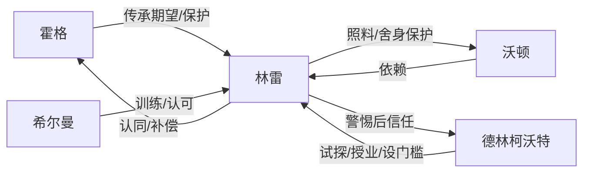

# 六维拆书：盘龙（开篇 1-23 章）

## 1. 人物维度

- 林雷：以行动证明型主角；缺口是弱小与家族衰败，稳定目标从“扛住训练”升级为“恢复家族荣耀并进入魔法道路”。证据：第 1、3、12-13、21-23 章（A）。
- 霍格：家族历史与目标的传递者，同时提供现实压力与父子情感。证据：第 2-3、12-13 章（A）。
- 德林柯沃特：规则解释者、训练门槛设置者；第 18 章后改变主角成长路线。证据：第 18-23 章（A）。

| 人物 | 初始缺口 | 主动目标 | 核心行动 | 截止第23章状态 | 功能与弧线 | 证据 |
|---|---|---|---|---|---|---|
| 林雷 | 家族衰败、自身弱小、血脉资格未知 | 复兴家族并找到可行成长道路 | 超龄坚持训练、血脉失败后立誓、主动争取测试、灾难中护弟、接受规则训练 | 已有导师并完成首次可验证施法 | 行动证明型成长主轴；每次抬高世界上限后都把震撼转成下一步行动 | SB-001 至 SB-006；原文/原文.txt:L1-L1418；A 明确 |
| 霍格 | 家族荣耀只剩历史，资源不足 | 把使命传给下一代又避免压垮孩子 | 揭示家史、组织检测、失败后安慰、同意探索新道路 | 从单向期待转为与长子共同承担目标 | 使命传递者兼现实压力源；不是阻碍型父亲 | SB-001、SB-003；原文/原文.txt:L160-L300；原文/原文.txt:L738-L848；A 明确 |
| 德林柯沃特 | 以未知灵魂身份出现，可信度不足 | 建立师徒关系并验证学徒资格 | 自证身份、解释规则、进行检测、设定训练门槛、验收首次成果 | 获得有条件信任，成为私密导师 | 把一次性奇遇转为长期规则化成长 | SB-005、SB-006；原文/原文.txt:L1071-L1418；A 明确 |
| 沃顿 | 年幼且缺乏自保能力 | 无独立主线目标 | 依赖兄长并在灾难中被保护 | 成为主角守护选择的关系证据 | 使“重视家人”从标签变成付代价的行动 | SB-002、SB-004；原文/原文.txt:L301-L521；原文/原文.txt:L849-L1070；A 明确 |

### 人物架构诊断

- 主角的“毅力”不是静态标签：SB-001 先用超龄训练核证，SB-003 将仰望改成申请测试，SB-004 又用护弟选择证明价值排序。
- 父亲、导师分别提供使命与方法，功能互补；前者解释为何成长，后者解释如何成长，没有争抢同一叙事岗位。
- 节选内反派人格尚未建立，主要压力来自血脉门槛、资源缺口、强者世界和灾难；这也是后续留存风险之一。

## 2. 人物关系图谱

### 实体归一

| 规范名 | 别名/称呼 | 处理 |
|---|---|---|
| 林雷·巴鲁克 | 林雷、雷 | 统一为林雷；单字昵称不单独建实体 |
| 霍格·巴鲁克 | 霍格 | 统一为霍格 |
| 德林柯沃特 | 德林爷爷 | 统一为德林柯沃特；亲昵称呼保留在关系语境 |

### 完整有向关系表

| 主体 | 关系动作 | 客体 | 起点状态 | 触发与变化 | 当前状态 | 证据 |
|---|---|---|---|---|---|---|
| 霍格 | 传承期望并保护 | 林雷 | 父亲安排训练，孩子被动承接身份 | 揭示家族历史；检测失败后没有责罚；同意探索魔法道路 | 共同承担复兴目标，同时给出选择空间 | SB-001、SB-003；原文/原文.txt:L160-L300；原文/原文.txt:L738-L848；A 明确 |
| 林雷 | 认同并补偿 | 霍格 | 接受父亲安排 | 看见家族困境和父亲失落后主动立誓 | 主动把复兴责任纳入个人目标 | SB-001；原文/原文.txt:L160-L300；A 明确 |
| 林雷 | 照料并舍身保护 | 沃顿 | 日常手足依恋 | 灾难中用身体护住弟弟并受伤 | 保护义务经过真实代价验证 | SB-002、SB-004；原文/原文.txt:L301-L521；原文/原文.txt:L849-L1070；A 明确 |
| 沃顿 | 依赖 | 林雷 | 年幼手足 | 日常照料与灾难保护强化依赖 | 仍是受保护方，尚无反向照料证据 | SB-002、SB-004；原文/原文.txt:L301-L521；原文/原文.txt:L849-L1070；A 明确 |
| 德林柯沃特 | 试探、授业并设门槛 | 林雷 | 戒中陌生灵魂与持有者 | 身份说明、天赋检测、训练与验收 | 师徒关系建立，导师掌握规则解释权 | SB-005、SB-006；原文/原文.txt:L1071-L1418；A 明确 |
| 林雷 | 警惕后接受指导 | 德林柯沃特 | 不知对方身份与意图 | 经身份信息和检测结果交叉验证 | 有条件信任并执行训练 | SB-005、SB-006；原文/原文.txt:L1071-L1418；A 明确 |
| 希尔曼 | 训练并认可 | 林雷 | 教官与幼年学员 | 见证其超龄毅力 | 早期成长见证者 | SB-001；原文/原文.txt:L1-L159；A 明确 |

### 核心关系演变链

| 关系 | 起点状态 | 触发动作 | 新状态 | 不可逆变化 | 块级来源 |
|---|---|---|---|---|---|
| 霍格 → 林雷 | 安排训练的父子 | 揭示家史、组织血脉检测、失败后安慰、允许尝试新道路 | 共同承担复兴目标 | 主角已主动认领使命，不能再退回“不知家史”的儿童状态 | SB-001 → SB-003 |
| 林雷 → 沃顿 | 日常手足 | 长期照料后在灾难中舍身保护 | 保护者与被保护者 | 关系价值已经过代价核证，后续危险会天然牵动守护承诺 | SB-002 → SB-004 |
| 德林柯沃特 ↔ 林雷 | 陌生灵魂与戒指持有者 | 身份揭示、双向试探、资质检测、训练验收 | 有条件信任的师徒 | 成长路线从外部测试转为长期私密训练 | SB-005 → SB-006 |

## 3. 冲突矩阵

| 冲突 | 外部阻力 | 内部缺口 | 当前状态 | 证据 |
|---|---|---|---|---|
| 弱小 vs 强者世界 | 等级差距、圣域灾难 | 能力不足 | 转入魔法成长路线 | 第1、8-23章 A |
| 家族荣耀 vs 当下衰败 | 资源与血脉门槛 | 检测失败 | 目标已立，尚未结算 | 第2-3章 A |
| 普通物件 vs 命运机缘 | 所有人低估戒指 | 主角不知情 | 第18章完成第一次翻面 | 第6-18章 A |

## 4. 故事时间维度

| ST-ID | 客观时序 | 事件 | 状态结果 | 证据 |
|---|---:|---|---|---|
| ST-001 | 1 | 林雷参加晨练并展现超龄毅力 | 获得希尔曼认可，行动型底盘成立 | SB-001；原文/原文.txt:L1-L159；A 明确 |
| ST-002 | 2 | 霍格揭示家族历史并进行血脉检测 | 资格失败，主角主动立下复兴目标 | SB-001；原文/原文.txt:L160-L300；A 明确 |
| ST-003 | 3 | 数月苦练期间拾得盘龙戒指 | 奇物以廉价饰物身份进入日常 | SB-002；原文/原文.txt:L301-L521；A 明确 |
| ST-004 | 4 | 强者过境并展示魔法上限 | 成长目标从模糊变强收束为接受魔法测试 | SB-003；原文/原文.txt:L522-L848；A 明确 |
| ST-005 | 5 | 圣域战斗波及乌山镇 | 林雷护弟受伤，鲜血触发戒指变化 | SB-004；原文/原文.txt:L849-L1070；A 明确 |
| ST-006 | 6 | 德林柯沃特现身、收徒并检测资质 | 私密导师和规则化成长路线建立 | SB-005；原文/原文.txt:L1071-L1288；A 明确 |
| ST-007 | 7 | 数月魔法苦修后首次成功施法 | 第一轮能力闭环完成，影鼠开启新阅读债 | SB-006；原文/原文.txt:L1289-L1418；A 明确 |

## 5. 叙事顺序、双时间线与信息差

### 叙事揭示顺序

| NT-ID | 叙事位置 | 揭示内容 | 知情边界 | 叙事功能 | 对应客观事件 |
|---|---:|---|---|---|---|
| NT-001 | 第2章 | 巴鲁克家族曾有龙血战士荣耀 | 霍格早知；林雷与读者同步得知 | 抬高身份期待后安排资格检测 | ST-002 之前的家族历史回溯 |
| NT-002 | 第6-7章 | 戒指表面被判断为廉价 | 角色与读者共同低估 | 把高价值变量伪装成日常饰物 | ST-003 |
| NT-003 | 第17章 | 鲜血被戒指吸收 | 读者先看到；林雷未察觉 | 形成短程读者先知优势 | ST-005 |
| NT-004 | 第18章 | 戒中寄宿圣域魔导师灵魂 | 林雷与读者同步确认 | 集中兑现第6章以来的长伏笔 | ST-006 |
| NT-005 | 第20-21章 | 地系亲和与精神力检测结果 | 德林先掌握规则；林雷与读者随检测得知 | 把惊喜转成可验证资格 | ST-006 |

### 信息差与披露边界

| 信息 | 作者事实 | 角色已知 | 读者已知 | 延迟/错位作用 | 截止状态 |
|---|---|---|---|---|---|
| 家族过去 | 霍格早已掌握 | 第2章后林雷知道 | 第2章同步获知 | 先给荣耀再安排失败，形成目标落差 | 已披露 |
| 戒指价值 | 第6章出现时已具异常价值 | 第18章前只当饰物 | 第17章看到吸血迹象，略早于主角 | 角色低估与读者先知分两步抬高期待 | 第18章核心价值已披露 |
| 龙血异常反应 | 第10章存在身体反应 | 林雷感知但不理解 | 读者知道异常发生 | 留出血脉线未决问题 | C 暂定；节选未解释 |
| 战刀赎回 | 家族目标已成立 | 林雷明确认领 | 读者同步知道 | 提供比短期学艺更长的使命 | A 明确；未结算 |

### 伏笔与回收

| 伏笔 | 埋设 | 回扣 | 回收/当前状态 | 证据 |
|---|---|---|---|---|
| 被低估的盘龙戒指 | 第6-7章廉价判断 | 第17章吸收鲜血 | 第18章揭示戒中灵魂；功能开始兑现 | SB-002、SB-004、SB-005；原文/原文.txt:L423-L521；原文/原文.txt:L1019-L1130；A 明确 |
| 血脉资格与身体异常 | 第3章检测失败 | 第10章出现异常反应 | 节选内未解释，不得断言后续答案 | SB-001、SB-003；原文/原文.txt:L236-L300；原文/原文.txt:L628-L678；C 暂定 |
| 复兴家族与赎回战刀 | 第2-3章家史与立誓 | 后续行动持续以变强为前提 | 节选内未结算 | SB-001 至 SB-006；原文/原文.txt:L160-L1418；A 明确 |

## 6. 题材、规模与三处亮点

- 题材：西方奇幻、升级成长、家族复兴；本样本为 23 章开篇节选。
- 亮点一：先展示力量天花板，再让主角用行动回应。
- 亮点二：廉价戒指跨 12 章完成身份与功能跃迁。
- 亮点三：护弟选择造成真实代价，并与机缘触发形成因果。

## 7. 三维节奏

评分锚点：剧情强度/情绪强度为 1-5，描写密度为 1-3。块级分数来自 `structure_blocks.csv`；章级表只展开同次阅读已核证的 `rhythm_anchors`，不补造逐章曲线。

### 结构块三轴曲线

| 结构块/RH-ID | 章节范围 | 剧情强度 | 情绪类型 | 情绪强度 | 描写密度 | 峰谷功能 | 证据/置信度 |
|---|---|---:|---|---:|---:|---|---|
| SB-001/RH-001 | 1-3 | 3 | 失落转决心 | 4 | 2 | 建立成长与家族缺口；资格失败后把低谷转成主动目标 | SB-001；原文/原文.txt:L1-L300；A 明确 |
| SB-002/RH-002 | 4-7 | 2 | 陪伴转好奇 | 3 | 2 | 低强度日常蓄力并埋入被低估变量 | SB-002；原文/原文.txt:L301-L521；A 明确 |
| SB-003/RH-003 | 8-13 | 4 | 震撼转向往 | 5 | 3 | 展示力量天花板，再把情绪峰值转成新目标 | SB-003；原文/原文.txt:L522-L848；A 明确 |
| SB-004/RH-004 | 14-17 | 5 | 紧张转惊异 | 5 | 3 | 外部灾难使三轴同升，关系选择与伏笔触发叠在峰值 | SB-004；原文/原文.txt:L849-L1070；A 明确 |
| SB-005/RH-005 | 18-21 | 3 | 惊喜转希望 | 5 | 3 | 外部强度回落，信息兑现和规则验证维持高情绪 | SB-005；原文/原文.txt:L1071-L1288；A 明确 |
| SB-006/RH-006 | 22-23 | 3 | 满足转好奇 | 4 | 2 | 时间压缩后用首次施法微兑现，再立新债 | SB-006；原文/原文.txt:L1289-L1418；A 明确 |

### 已核证章级峰谷锚点

| 章节 | 所属块 | 锚点 | 剧情强度 | 情绪强度 | 描写密度 | 作用 | 证据 |
|---|---|---|---:|---:|---:|---|---|
| 第3章 | SB-001 | 峰值/释放 | 3 | 4 | 2 | 血脉失败与主动立誓在同章完成低谷转向 | 原文/原文.txt:L236-L300；A 明确 |
| 第6章 | SB-002 | 峰值 | 2 | 3 | 2 | 低强度生活中把未定价变量送入读者记忆 | 原文/原文.txt:L423-L469；A 明确 |
| 第10章 | SB-003 | 峰值 | 4 | 5 | 3 | 奇观将力量差距视觉化，情绪先于行动达到高位 | 原文/原文.txt:L628-L678；A 明确 |
| 第13章 | SB-003 | 释放 | 3 | 5 | 2 | 仰望收束为可执行的魔法测试 | 原文/原文.txt:L796-L848；A 明确 |
| 第16章 | SB-004 | 峰值 | 5 | 5 | 3 | 灾难逼近居民，外部威胁与动作描写同步变密 | 原文/原文.txt:L957-L1018；A 明确 |
| 第17章 | SB-004 | 释放/余波 | 5 | 5 | 3 | 护弟付出代价并触发戒指异常，峰值同时制造新债 | 原文/原文.txt:L1019-L1070；A 明确 |
| 第18章 | SB-005 | 峰值 | 3 | 5 | 3 | 长伏笔揭晓，剧情动作回落而信息和惊喜保持高位 | 原文/原文.txt:L1071-L1129；A 明确 |
| 第21章 | SB-005 | 释放 | 3 | 5 | 2 | 资质验证把奇遇转成可持续训练希望 | 原文/原文.txt:L1242-L1288；A 明确 |
| 第23章 | SB-006 | 释放/余波 | 3 | 4 | 2 | 首次能力兑现后立刻以新未知对象续债 | 原文/原文.txt:L1345-L1418；A 明确 |

### 曲线诊断与循环

- 剧情峰值落在 SB-004；此前 SB-002 的低强度日常和 SB-003 的奇观升级构成两级蓄力，不是连续同强度推进。
- 情绪峰值跨 SB-003 至 SB-005：先是仰望，再是灾难紧张，最后转为伏笔兑现的惊喜；情绪类型变化避免高位疲劳。
- 描写密度只在强者展示、灾难和规则初次展开时升至 3；SB-006 回落到 2，为下一单元留出呼吸。
- 可迁移循环是“身份缺口→低回报行动→展示天花板→高压选择→伏笔兑现→规则训练→微兑现与新债”，不是固定五章或十章切块。

## 8. 全局约束与边界

本文件只覆盖开篇节选，不代表全书后期结构；具体专名、能力、戒指与灾难顺序不可迁移。

## 结构块证据回链

| 结构块 | 原文定位 | grep 关键词 | 置信度 |
|---|---|---|---|
| SB-001 | 原文/原文.txt:L1-L300 | 血脉检测 | A 明确 |
| SB-002 | 原文/原文.txt:L301-L521 | 盘龙戒指 | A 明确 |
| SB-003 | 原文/原文.txt:L522-L848 | 火蛇之舞 | A 明确 |
| SB-004 | 原文/原文.txt:L849-L1070 | 沃顿 | A 明确 |
| SB-005 | 原文/原文.txt:L1071-L1288 | 德林柯沃特 | A 明确 |
| SB-006 | 原文/原文.txt:L1289-L1418 | 撼地术 | A 明确 |
